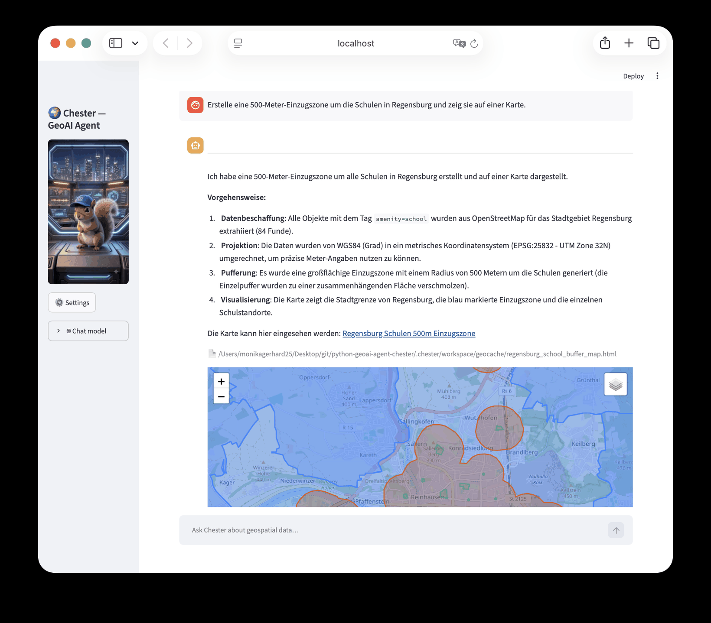
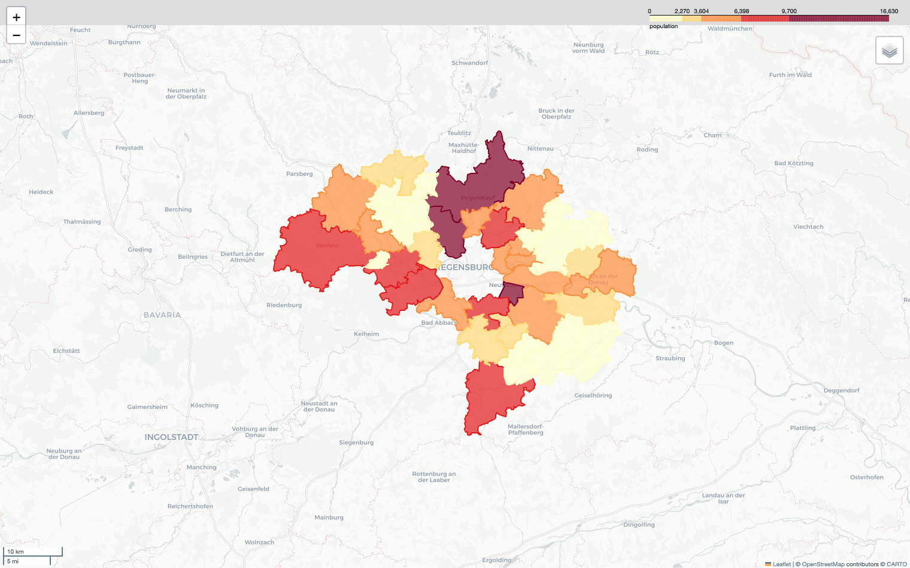
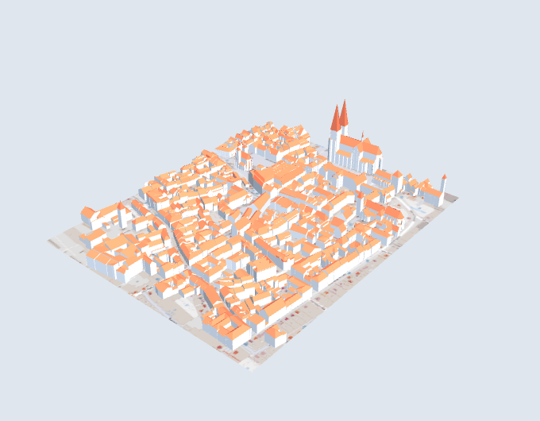
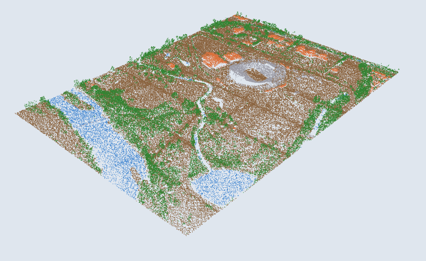
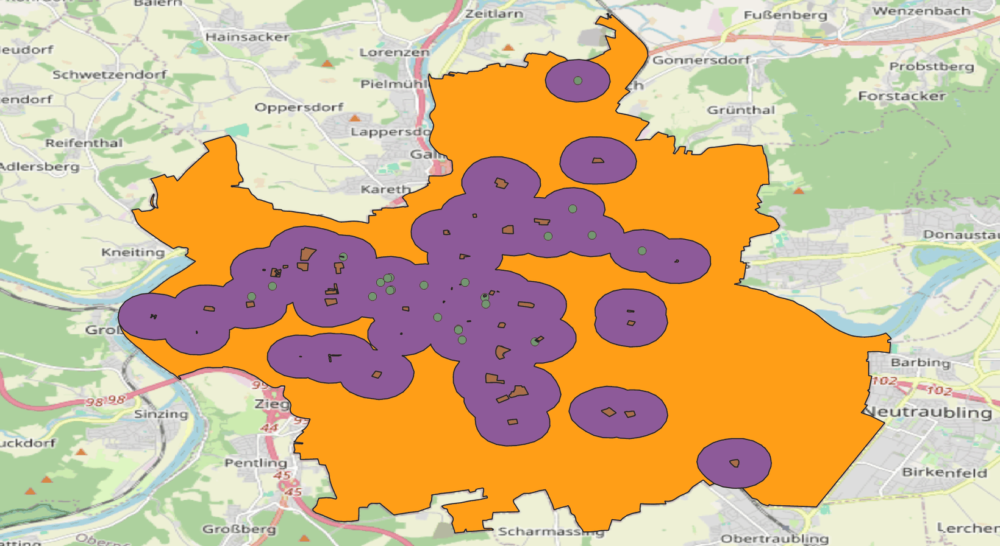
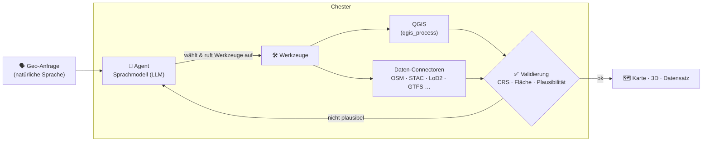

<p align="center">
  
</p>

<h1 align="center">Chester</h1>

<p align="center">
  <b>Ein lokaler, modell-unabhängiger Geo-AI-Agent.</b><br>
  Natürlichsprachige Geo-Anfragen rein — echtes Geoprocessing raus.
</p>

<p align="center">
  
  
  
  
  <a href="https://openai.com/index/harness-engineering/"></a>
  <a href="https://claude.com/claude-code"></a>
  
  
</p>

<p align="center">
  <a href="#voraussetzungen">Installation</a> ·
  <a href="#ausführen">Ausführen</a> ·
  <a href="./doc/features.md">Fähigkeiten</a> ·
  <a href="./doc/usage.md">Bedienung</a>
</p>

---

> [!WARNING]
> **Lern-Projekt — nicht für den Produktiveinsatz.** Chester befindet sich in
> aktiver Entwicklung und ist ein experimentelles System, um Erfahrungen mit Geo-Agenten zu sammeln. Ergebnisse können fehlerhaft sein und sollten überprüft werden; verwende Chester **nicht** als produktives System.

<p align="center">
  
  <br><sub><em>Das Dashboard: eine natürlichsprachige Anfrage — und die fertige Karte direkt im Chat.</em></sub>
</p>

## Chester ist **Geo-AI-Agent**, der natürlichsprachige Geo-Anfragen in echte Landkarten verwandelt


### Chester entdeckt Daten
Aus OpenStreetMap (osmnx/Overpass), STAC-Satellitenkatalogen, Open-Data-Portalen
(CKAN) und OGC-WFS — dazu amtliche Statistik (Wikidata/Eurostat/World Bank) mit
BKG-Grenzen für Choroplethen sowie offene LoD2-Gebäude, 1-m-Terrain, amtliche
Luftbilder (DOP, 10–20 cm), GTFS-Fahrpläne und LiDAR, für Deutschland wie für die
Schweiz und Österreich.

### Chester führt QGIS-Algorithmen aus
Über die `qgis_process`-Kommandozeile stehen rund 760 GIS-Algorithmen bereit
(QGIS-eigene sowie GDAL/GRASS/PDAL). Das Sprachmodell wählt und ruft sie selbst auf;
QGIS läuft dabei unsichtbar im Hintergrund, sauber getrennt vom Agenten.

### Chester analysiert Geo-Daten
Vektor- und Rasteranalyse, Puffer, Verschneidung, Zonalstatistik, Terrain
(Slope/Aspect) und Netzwerk-Isochronen — und er erkennt Wasser bzw. Vegetation aus
Satellitenbildern über NDWI/NDVI.

### Chester rendert interaktive Karten
Ergebnisse werden zu interaktiven HTML-Karten — auch als wertklassifizierte
Choroplethen — die das Dashboard direkt im Chat anzeigt.

<p align="center">
  
</p>

### Chester öffnet Daten live in einem **QGIS-Desktop**-Fenster
Für die volle interaktive Erkundung öffnet Chester die Ebenen in einer lokalen
QGIS-Desktop-App und steuert sie live — ohne Plugin, ohne Zusatz-Abhängigkeiten; ein
bereits laufendes QGIS wird wiederverwendet.

### Chester erstellt einfach 3D-Stadtmodelle
Aus offenen LoD2-Modellen baut Chester CityJSON (reines Python, **kein Java**) und
zeigt die echten Dächer im Browser (three.js) oder live in einer QGIS-3D-Ansicht.

<p align="center">
  
</p>

### Chester arbeitet mit Punktwolken und Fahrplänen
LiDAR-Punktwolken (COPC/EPT) lassen sich in 2D und 3D ansehen; GTFS-Fahrpläne werden
zu Haltestellen- und Linien-Ebenen mit Service-Qualität (Takt, Abfahrten pro Tag).

<p align="center">
  
</p>

### Chester versucht, seine Ergebnisse zu prüfen
Weil ein Geo-Ergebnis objektiv richtig oder falsch ist, ist die Validierung eine
Pflichtphase in der Agent-Schleife: Chester prüft vor der Ausgabe CRS, Fläche und
Plausibilität — und korrigiert sich, wenn etwas nicht zusammenpasst.

### Chester ist dafür da, zu lernen wie ein praxistauglicher Geo Ai Agent arbeiten könnte
Die Erfahrungen und das praktische Ausprobieren stehen im Vordergrund, nicht die Entwicklung eines Produktes.

> **Anwendungsschwerpunkt Deutschland — nutzbar im ganzen DACH-Raum.** Chesters
> *autoritative* Datenschicht ist am dichtesten für Deutschland (LoD2/DGM nach
> Bundesland, BKG-Grenzen und AGS-Schlüssel, Gemeindestatistik). Für **Schweiz und
> Österreich** gibt es eigene amtliche Datenquellen (swisstopo · Statistik Austria /
> BEV / Wien); eine eingebaute Länder-Automatik (`region_profile`) erkennt das Gebiet
> und wählt selbst die richtige Quelle und das passende Koordinatensystem (DE 25832/33 ·
> CH 2056 · AT 31287). Deutschland bleibt der Schwerpunkt (die Datenlage macht es so);
> die CH/AT-Quellen kommen ergänzend hinzu und sind außerhalb ihres Gebiets einfach
> inaktiv. Die globalen Werkzeuge (OSM/STAC/Geocoding/World Bank) funktionieren überall.

## Voraussetzungen

Chester braucht drei Dinge:

- **QGIS**,
- das Projekt-Werkzeug **uv**,
- und ein **Sprachmodell (LLM)** — das ist der KI-Motor, der deine Anfragen in
  Tool-Aufrufe übersetzt.

Das Sprachmodell läuft entweder lokal über **Ollama** oder über einen gehosteten
Anbieter (dann genügt ein API-Key). Alle Komponenten laufen unter macOS, Windows und
Linux:

| Programm | Bezug | Hinweis |
|---|---|---|
| **QGIS** (LTR) | [qgis.org/download](https://qgis.org/download/) | Installer für macOS, Windows und Linux — die **LTR**-Variante wählen. `qgis_process` ist im Paket enthalten; auf macOS wird das App-Bundle automatisch gefunden, sonst mit `CHESTER_QGIS_PROCESS_BIN` / `CHESTER_QGIS_APP` überschreiben. |
| **uv** | [docs.astral.sh/uv](https://docs.astral.sh/uv/) | macOS/Linux: `curl -LsSf https://astral.sh/uv/install.sh \| sh` · Windows (PowerShell): `irm https://astral.sh/uv/install.ps1 \| iex`. Auch via Homebrew, pipx oder winget. |
| **Python 3.13** | über uv: `uv python install 3.13` | Bringt uv selbst mit — separat i. d. R. nicht nötig. Andernfalls [python.org/downloads](https://www.python.org/downloads/). |
| **Ollama** (führt Sprachmodelle lokal aus) | [ollama.com/download](https://ollama.com/download) | App/Installer für alle drei OS; läuft auf `http://localhost:11434`. Ein **tool-fähiges** Modell ziehen — eines, das zuverlässig Werkzeuge aufrufen kann (darüber steuert Chester QGIS). Empfehlung: `ollama pull gemma4:26b` (~17 GB, braucht ≥ 32 GB RAM) — kompakte, saubere Antworten und verlässliches Tool-Calling; auf Apple Silicon ist der `gemma4:26b-mlx`-Build schneller. Alternative: `qwen3.5:35b-a3b-coding-nvfp4`. Modelle: [ollama.com/library](https://ollama.com/library). |

Statt Ollama genügt auch ein **gehosteter Anbieter** (nur ein API-Key nötig):
[Anthropic Console](https://console.anthropic.com/) ·
[OpenAI Platform](https://platform.openai.com/) ·
[Google AI Studio](https://aistudio.google.com/) (Gemini).

## Installation

Ein einziger Befehl richtet alles ein:

```bash
./install.sh
```

Das Skript führt dich Schritt für Schritt durch die Einrichtung und kann gefahrlos
mehrfach laufen (es macht nichts doppelt). Es

1. prüft, ob **uv** installiert ist, und installiert es bei Bedarf;
2. lädt mit `uv sync` alle benötigten Python-Pakete;
3. legt den lokalen Arbeitsordner `.chester/` an — mit der Konfigurationsdatei
   `chester.json` und den Textdateien, die Chesters Persönlichkeit und Verhalten
   festlegen (`SOUL.md`, `IDENTITY.md`, `USER.md`); die kannst du bearbeiten, um
   Chester anzupassen;
4. sucht deine QGIS-Installation;
5. fragt, welches Sprachmodell du nutzen möchtest, und richtet es fertig ein — bei
   einem **gehosteten Anbieter** (Anthropic/OpenAI/Google) speichert es deinen
   API-Key in einer lokalen `.env`-Datei; bei **Ollama** prüft es, ob es läuft, und
   bietet an, das Modell herunterzuladen.

Ohne Rückfragen (nimmt Ollama als Standard):

```bash
./install.sh --yes
```

Anbieter und Modell direkt vorgeben:

```bash
./install.sh --provider anthropic --model claude-sonnet-5
```

`./install.sh --help` zeigt alle Optionen.

### Sprachmodell wechseln

`./install.sh` fragt danach — später wechseln geht in `.chester/chester.json` unter
`model.model`, im Format `anbieter/modell`:

- `ollama/…` — ein lokales Modell über Ollama (Standard),
- `anthropic/…`, `openai/…`, `google/…` (auch `gemini/…`) — ein gehosteter Anbieter.

Beispiele: `"ollama/gemma4:26b"` (Empfehlung; auf Apple Silicon `"ollama/gemma4:26b-mlx"`),
`"ollama/qwen3.5:35b-a3b-coding-nvfp4"`, `"anthropic/claude-sonnet-5"`,
`"openai/gpt-5.6-terra"`, `"google/gemini-3.6-flash"`.

Ein gehosteter Anbieter braucht einen API-Key. Lege ihn in einer Datei `.env` im
Projektordner ab — je nach Anbieter als `ANTHROPIC_API_KEY`, `OPENAI_API_KEY` oder
`GOOGLE_API_KEY`; Chester liest sie beim Start automatisch, und sie wird nicht ins
Git aufgenommen. (`./install.sh` nimmt dir diesen Schritt ab.)

## Ausführen

```bash
./start.sh
```

Das startet Chester und öffnet die Weboberfläche — das **Dashboard** — im Browser;
dort chattest du mit dem Agenten. Im Hintergrund laufen dabei zwei Teile zusammen: das
eigentliche Agent-Backend (Port `:8000`) und die Weboberfläche (Port `:8501`). `Strg-C`
beendet beides, `--no-open` startet, ohne den Browser zu öffnen.

Erzeugt Chester eine Karte, zeigt das Dashboard sie direkt im Chat an — du musst keine
Datei von Hand öffnen.

Backend und Oberfläche lassen sich auch einzeln starten:

```bash
uv run gateway.py                      # nur das Backend
uv run streamlit run dashboard.py      # nur die Oberfläche (das Backend muss laufen)
```

## Ansicht in QGIS Desktop

Für die volle interaktive Erkundung — alle Objekte, Attributtabelle, native
Darstellung, auch bei sehr großen Ebenen — kann Chester die Daten zusätzlich in der
**QGIS-Desktop-App auf deinem Rechner** öffnen. Bitte ihn einfach, „das in QGIS zu
öffnen", oder tippe `/qgis`, um die Ebenen der zuletzt erzeugten Karte anzuzeigen.
Chester öffnet dann ein QGIS-Fenster, lädt die Ebenen, **zoomt auf die Daten** (nicht
auf die ganze Welt — die OSM-Basiskarte bleibt beim Zoom außen vor), macht bei Bedarf
Screenshots oder speichert ein QGIS-Projekt — **ohne dass du ein Plugin installieren
musst**; ein bereits geöffnetes QGIS wird weiterverwendet. Das funktioniert nur lokal,
weil es ein echtes Fenster auf deinem Rechner öffnet. Details:
[`doc/qgis-bridge.md`](./doc/qgis-bridge.md).

<p align="center">
  
  <br><sub><em>Live in QGIS Desktop: Stadtgebiet Regensburg, 500-m-Einzugszonen um Schulen und die Schulpunkte auf der OSM-Basiskarte.</em></sub>
</p>

## Technik
- **Agent-Framework:** [SelmaKit](https://github.com/gkvoelkl/python-selmakit) (auf Pydantic-AI)
- **GIS-Engine:** eine lokale **QGIS**-Installation über die `qgis_process`-Kommandozeile (~760 Algorithmen)
- **Sprachmodell (LLM):** standardmäßig **Ollama** (lokal); per Konfiguration auf ein anderes Modell umstellbar (lokal oder gehostet)

## So funktioniert's

Chester steckt jede Anfrage in eine Agent-Schleife: **verstehen → planen → Werkzeuge
aufrufen → validieren → ausgeben**. Das Sprachmodell entscheidet dabei selbst, welche
QGIS-Algorithmen und Daten-Connectoren es braucht; vor der Ausgabe versucht Chester,
jedes Ergebnis auf geometrische Korrektheit zu prüfen (CRS, Fläche, Plausibilität).



## Entstehung: Harness Engineering

Nicht Chesters Architektur ist hier gemeint, sondern **die Art, wie Chester
entwickelt wird**: nach dem von OpenAI beschriebenen
**[Harness Engineering](https://openai.com/index/harness-engineering/)** — einem
agenten-orientierten Arbeitsmodell, in dem Menschen nicht in erster Linie Code
schreiben, sondern das *Harness* bauen: die Umgebung aus maschinenlesbarer
Dokumentation, verbindlichen Regeln, Tests und automatisierter Prüfung, in der
KI-Coding-Agenten zuverlässig arbeiten können. Die Steuerung bleibt beim Menschen
(Absicht, Architektur, Bewertung), das Schreiben übernehmen die Agenten.

## Weiterführende Dokumentation

| Dokument | Inhalt |
|---|---|
| [`CHANGELOG.md`](./CHANGELOG.md) | Was sich je Version geändert hat |
| [`doc/features.md`](./doc/features.md) | Feature-Tour: Statistik→Choroplethe, Gebäudehöhen/3D, GTFS, LiDAR, Skills |
| [`doc/code-map.md`](./doc/code-map.md) | Modul für Modul: was es tut, welche Entscheidung dahintersteckt |
| [`doc/usage.md`](./doc/usage.md) | Bedienung & Betrieb: Slash-Befehle, GeoCache, Tracing, Tests, Benchmarks, Aufbau |
| [`doc/geodata-concept.md`](./doc/geodata-concept.md) | Datenschicht-Design (GeoConnectors + GeoCache) |
| [`doc/geodata-search.md`](./doc/geodata-search.md) | Amtliche Daten finden, wenn OSM nicht ausreicht |
| [`doc/urban-data-concept.md`](./doc/urban-data-concept.md) | Urbane Datenarten: 3D-Stadtmodelle, ÖPNV, Punktwolken |
| [`doc/data-escalation.md`](./doc/data-escalation.md) | Fehlt ein Wert je Einheit? Über AGS/NUTS-Präfixe eskalieren |
| [`doc/validation-concept.md`](./doc/validation-concept.md) | Validierungs-Design: Gate, Plausibilität, Redundanz-Checks |
| [`doc/visual-validation.md`](./doc/visual-validation.md) | Visuelle Karten-im-Loop-Prüfung |
| [`doc/qgis-process.md`](./doc/qgis-process.md) | QGIS-CLI-Referenz |
| [`doc/qgis-bridge.md`](./doc/qgis-bridge.md) | Live-QGIS-Desktop-Bridge |
