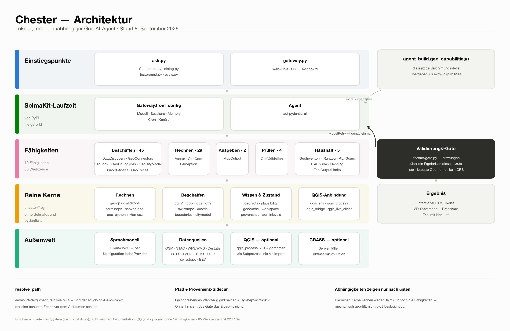

# Code-Map

Ein Eintrag je Modul: wozu es da ist, welche Entscheidung dahintersteckt und wo die
Fallstricke liegen. Diese Datei ist die ausführliche Fassung; die kurze Landkarte mit
den harten Regeln liegt in der Projektanweisung im Wurzelverzeichnis.

Die Beschreibungen sind **englisch** — sie stehen Seite an Seite mit englischen
Bezeichnern und Pfaden (siehe Sprachregelung in [`features.md`](./features.md)).

> **Wozu das gut ist:** Was der Agent nicht im Repository lesen kann, existiert für ihn
> nicht. Eine Chat-Diskussion, die ein Muster festgelegt hat, ist für ihn so unsichtbar
> wie für einen Kollegen, der drei Monate später anfängt.

## Wie die Teile zueinander stehen

  

Die Schichtung ist die eine Aussage, die man vor allen Moduleinträgen braucht:
**Abhängigkeiten zeigen nur nach unten.** Die reinen Kerne kennen weder SelmaKit noch
`chester.capabilities`; `gate.py` ist die einzige dokumentierte Ausnahme und hängt
seitlich am Agenten.

> **Zwei Zählweisen, nicht verwechseln.** Das Bild zählt die Fähigkeiten, die zur
> Laufzeit im Prompt stehen — dort zählen SelmaKits eigene Beiträge (`Planning`,
> `ToolOutputLimits`, die Web-Instruktion) mit, die drei QGIS-Fähigkeiten dagegen nur,
> wenn QGIS da ist: **19 / 85 ohne QGIS, 22 / 109 mit**. Die Tabelle unten zählt
> Chesters eigene Capability-*Klassen*: **neunzehn**, unabhängig von QGIS. Dass beide
> Zahlen im QGIS-losen Fall 19 ergeben, ist Zufall und nicht dieselbe Menge.

## Die neunzehn Capabilities auf einen Blick

Jede erbt von `AbstractCapability` und hat `get_instructions()` (erzwungen durch
`tests/test_structure.py`). Die sechs ältesten stammen aus Phase 1/2 und bilden den
Kern, den ein neuer Leser zuerst braucht — sie stehen deshalb zuerst.

| Capability | Modul | Werkzeuge |
|---|---|---|
| `QgisToolboxCapability` | `qgis` | `qgis_search` · `qgis_describe` · `qgis_run` + benannte Wrapper (`qgis_reproject`, `qgis_buffer`, `qgis_rasterize`, `qgis_clip` (Vektor **und** Raster — ein Intent, zwei Algorithmen), `qgis_intersection`, `qgis_extract_by_location`, `qgis_extract_by_attribute`, `qgis_dissolve`, `qgis_field_sum`, `qgis_service_area`, `qgis_zonal_stats`, `qgis_raster_calc`) |
| `DataDiscoveryCapability` | `discovery` | Geocoding, OSM, STAC, WFS/WMS, die `fetch_*`-Familie (DEM/DGM1/DOP/swissALTI3D/…), Punktwolken |
| `PerceptionCapability` | `perception` | `spectral_index` · `detect_water` — NDWI/NDVI; mit `fetch_dop` (RGBI) rechnet es bei 10–20 cm statt bei 10 m. Bänder eines Komposits über `band_a_index`/`band_b_index`; **NDVI über eine Quelle ohne NIR wird abgelehnt, nicht gerechnet** |
| `VectorCapability` | `vector` | `vector_info` (mit `values_of=` auch die Werte einer Spalte) · `vector_filter` · `vector_overlay` · `vector_split_by_geometry` · die zehn geprüften Operationen aus `vectorops` (`vector_reproject`, `vector_buffer`, `vector_clip`, `vector_intersection`, `vector_extract_by_location`, `vector_extract_by_attribute`, `vector_dissolve`, `vector_merge`, `vector_join`, `vector_add_field`, `vector_field_sum`) · `geo_python_run` — der Sandbox-Notausgang, der **ohne** QGIS überlebt |
| `GeoCoreCapability` | `geocore` | Raster, Terrain und Netz ohne QGIS: `rasterize` · `sample_raster` · `zonal_stats` · `raster_calc` · `slope` · `aspect` · `hillshade` · `ruggedness` · `fill_sinks` · `flow_accumulation` (die letzten zwei über GRASS) · `service_area` |
| `RunLogCapability` | `runlog` | *keine* — reiner Beobachter, kostet nichts im Prompt. Existiert, weil ein Dashboard-Lauf bis zum Ende keine lesbare Spur hinterlässt |
| `PlanGuardCapability` | `planguard` | *keine* — beantwortet einen unveränderten Plan mit einer Korrektur statt mit „Plan updated"; die mechanische Hälfte dessen, was die Instruktion nur erbittet |
| `PromptCacheCapability` | `promptcache` | *keine* — schaltet Anthropics Prompt-Cache ein, und nur dann, wenn `model.model` ein Anthropic-Modell nennt. Ohne das zahlt ein gehosteter Lauf den ~14k-Token-Instruktionsvorspann bei jedem seiner ~20 Schritte |
| `ModelLimitsCapability` | `modellimits` | *keine* — setzt `max_tokens`, und nur bei einem Anthropic-Modell. Ohne das erbt ein gehosteter Lauf die Provider-Vorgabe und stirbt mitten im Denken |
| `GeoValidationCapability` | `validation` | `check_crs` · `sanity_check_result` · `check_topology` · `cross_check` |
| `MapOutputCapability` | `mapoutput` | `render_map` · `inspect_map` — HTML-Karten (Vektor + Raster), Choroplethen, WMS-Overlay |
| `GeoInventoryCapability` | `inventory` | `geocache_*` — der GeoCache-Bestand |
| `GeoConnectorsCapability` | `connectors` | GeoPackage/SpatiaLite/PostGIS |
| `GeoLod2Capability` | `lod2` | `lod2_sources` · `fetch_lod2` |
| `GeoBoundariesCapability` | `boundaries` | amtliche Grenzen DE/CH/AT |
| `GeoCityModelCapability` | `citymodel` | CityJSON, 3D-Gebäude |
| `GeoStatisticsCapability` | `statistics` | Eurostat · Wikidata · World Bank |
| `GeoTransitCapability` | `transit` | GTFS-Fahrpläne |
| `GeoLiveCapability` | `qgis_live` | `qgis_show*` — die lebende QGIS-Desktop-Brücke |
| `GeoPyCapability` | `qgis_python` | `qgis_python` — beliebiges PyQGIS als Notausgang |
| `GeoSkillGuideCapability` | `skillguide` | *keine* — nur Instruktionen: wann ein Skill zu laden ist |

## Module im Einzelnen

- `agent_build.py` — the capability factory (single source of truth, no import
  side effects): `geo_capabilities(workspace_dir)` returns Chester's sixteen geo
  capabilities, plus constants (`STATE_DIR`, `CONFIG_NAME`, `WORKSPACE_DIR`).
  Imported by `gateway.py` and `ask.py`. No `build_agent()` / no `SYSTEM_PROMPT` —
  the runtime is built by `Gateway.from_config`, and identity comes from
  workspace files (see the identity note below). Daneben
  `selmakit_capabilities(ctx)`: SelmaKits Standardsatz **minus**
  `_DROPPED_SELMAKIT_CAPABILITIES` (heute `CronCapability`), übergeben als
  `capabilities=` — der von SelmaKit vorgesehene Filterhaken (Sequenz *oder*
  Callable auf den `GatewayContext`), kein Fork: alles Übrige kommt weiter so, wie
  SelmaKit es liefert. Eine gestrichene *Fähigkeit* nimmt ihre Instruktionen mit,
  ein gestrichenes Werkzeug nicht — darum wird auf Fähigkeitsebene gefiltert.
  Cron ist gestrichen, weil kein Geo-Lauf je einen Job geplant hat und Chesters
  eigene Aufräumläufe auf einem Daemon-Thread liegen, nicht auf `CronService`;
  Gateway und `/cron`-Kommando bleiben verdrahtet, nur das Modell sieht das
  Werkzeug nicht mehr. **Gemessen: 211 Token** (457 Zeichen Instruktion + 376
  Zeichen Schema) — 0,7 % des Prompts. Wer hier mehr erwartet, prüfe erst, wo die
  Token wirklich liegen: 63 % sind Werkzeugschemata (95 Werkzeuge ≈ 19.200 Token). Also exports
  `register_geo_commands(agent)` (Phase 5.7): the `/geocache`, `/geoconnector`,
  `/geodataset` slash commands, registered on the agent via `@agent.command`
  decorators — thin formatters over the **same** `GeoCache`/connector callables
  the tools use (no drift); `prune`/`rm` are commands only, never agent tools.
  Also `/testprompt` — `/testprompt` lists the `agent-test-prompts.jsonl` bank,
  `/testprompt <id>` runs one benchmark prompt
  **in-chat** by returning SelmaKit's `RunPrompt(text=…)` (rewrite-and-run, the
  same mechanism as `/skill`), so the dashboard becomes an interactive test bench;
  the `testprompt.py` CLI runner stays for scripted/rubric runs. And `/qgis` —
  shows the **same layers as the last rendered map** in local QGIS **Desktop**:
  `render_map` writes a `geocache/last_map.json` pointer (html + resolved layer
  paths + column) and `/qgis` feeds those layers through the **live QGIS bridge**
  (`qgis_live_client.ensure_running` → `add_layers` → `zoom_full`) — the *same*
  mechanism as the `qgis_show` tool, so a running QGIS is reused (no second
  window) instead of a fresh `open -a` launch. QGIS can't open the Folium HTML, so
  it opens the source layers. And `/valid_level` — shows/sets the per-session
  strictness of the enforcing validation gate (`0`–`3`, default 1; writes the level
  into the session meta the gate reads, see `chester/gate.py`). These commands are
  registered in `gateway.py` only (webchat/dashboard), like the others. (The QGIS-viewer roadmap's earlier
  steps A/B — `open -a` launch + a separate `open_in_qgis` tool — were folded into
  this one bridge path; there is now a single mechanism for viewing in QGIS.)
- `setup.py` — project scaffolder (adapted from SelmaKit's). Writes
  `.chester/chester.json` (Chester's model pre-filled) and the workspace identity
  files, and deploys `./skills` → `.chester/workspace/skills`. Idempotent; called
  with `quiet=True` on every gateway/CLI start, or run once verbosely via
  `uv run python setup.py`.
- `gateway.py` — the SelmaKit reference gateway:
  `Gateway.from_config(STATE_DIR, CONFIG_NAME, capabilities=selmakit_capabilities,
  extra_capabilities=geo_capabilities())`, then `register_geo_commands(gateway.agent)`
  (Chester's slash commands, Phase 5.7), then `.run()`. All other wiring (model,
  stores, memory, cron, channels) is SelmaKit's. SSE on `:8000`. Run with
  `uv run gateway.py`. Das `capabilities=`-Argument ist der **einzige** Filter über
  SelmaKits Standardsatz (siehe `agent_build.selmakit_capabilities`); ein Aufrufer,
  der es vergisst, bekommt einen anderen Agenten als der Rest — dagegen steht ein
  Strukturtest.
- `dashboard.py` — 4 lines: `selmakit.dashboard.run(...)` with Chester branding +
  `config_file=.chester/chester.json`. Thin frontend that POSTs to the gateway's
  `/webchat/stream`. Run via `start.sh` (`:8501`). SelmaKit's dashboard embeds
  any local `.html` a reply references (e.g. a `render_map` Folium map in the
  workspace) inline in the chat — no Chester code, it just resolves the path on
  the shared host. Because that embedding is unconditional, a huge inline map can
  freeze the browser (a 490 MB HTML of all of Regensburg's buildings did) — so
  `render_map` guards against it — **drei** Wächter, und nur der dritte sagt
  voraus, was der Browser wirklich nicht schafft. Die zwei alten sind eine billige
  Objektzahl-Vorprüfung (`_MAX_INLINE_FEATURES`) und ein Größendeckel auf die
  fertige HTML (`_MAX_INLINE_MB`); beide melden `ok: false` + `embedded: false` +
  `recommend_tool: "qgis_show"` und schreiben nichts. Dazwischen fiel ein Fall
  hindurch: 6.888 Höhenlinien, weit unter 50.000 Objekten, 42,5 MB knapp unter dem
  45-MB-Deckel — und die Seite blieb weiß (2026-09-02,
  `pluvial-flow-accumulation-tegernheim`). Die Renderlast hängt weder an der
  Objektzahl noch an den Bytes, sondern an den **Stützpunkten**, die der Browser zu
  Pfaden machen muss: gemessen 936.687. Der dritte Wächter
  (`_MAX_INLINE_VERTICES`, 500k) zählt sie beim Lesen der Layer mit und
  unterscheidet sich in einem Punkt von den beiden anderen: Er meldet **`ok: true`**
  und gibt das **PNG** als `output` zurück, das `_write_picture_beside` ohnehin
  erzeugt. Ein vorhandenes Bild als Fehlschlag zu melden wäre die gespiegelte Form
  desselben Fehlers, gegen den die zwei anderen gebaut sind. Big layers belong in
  `qgis_show`, not an inline web map.
- `ask.py` — slim CLI for one-shot/interactive terminal chat (no web stack). Gets
  its agent from `Gateway.from_config(...).agent` (builds the agent without
  starting channels) so it shares the gateway's exact wiring. `ask()` streams the
  agent↔LLM exchange to stdout by default; pass a `sink` callable to redirect the
  *same* formatted stream elsewhere (die Bench hebt ihn als Protokoll auf) —
  identical event handling, so terminal and UI can't drift. Daneben `on_event`:
  dieselben Ereignisse **strukturiert** (`text` · `thinking` · `tool_call` ·
  `tool_result`, ungekürzt) für Verbraucher, die Zeilen als Zeilen brauchen statt
  als Text — heute `benchlive.py`. Reasoning geht **nur** an `on_event`, nie an
  `emit`: bei einem lokalen Reasoning-Modell steckt dort die meiste Laufzeit (im
  gemessenen Lauf 172 s bis zum ersten sichtbaren Zeichen), das Terminal-Protokoll
  bleibt aber, was es war. **`ask()` gibt die *validierte* Antwort zurück** — die mit der
  Advisory-Notiz des Gates, die in den gespeicherten Nachrichten nicht steht (SelmaKit
  sichert sie vor dem Validator); `testprompt.py`/`evals.py` schreiben sie als
  `[gate] …`-Zeile ins Protokoll und benoten diese Fassung. **Die Stelle hat drei
  Anläufe gebraucht, und das ist der Merkposten:** Am 27.08. so behauptet und nur auf
  Unit-Ebene geprüft; am 30.08. im ersten Dialoglauf widerlegt — SelmaKit 0.1.32 fing
  das `AgentRunResultEvent` in `run_stream_events` ab, `ask()` lieferte immer `None`,
  und *jede* Gate-Meldung war für Protokoll, Trace und Judge unsichtbar. Stromaufwärts
  behoben in **SelmaKit 0.1.33**, hier mit einem echten Lauf nachgewiesen
  (`tests/test_judge_guards.py::test_ask_returns_the_validated_answer`, hängt einen
  Validator an, der unbedingt anhängt). Vier Tage falsche Doku, weil die Bausteine
  stimmten und niemand die Kette gefahren hat.
- `trace.py` — viewer for the per-session trace SelmaKit persists at
  `.chester/sessions/<key>.json` (prompt, thinking, tool calls + args, results, reply).
- `testprompt.py` — benchmark test-prompt runner over `agent-test-prompts.jsonl`:
  `uv run testprompt.py` lists every test, `uv run testprompt.py <id>` prints the
  test's rubric (expected behaviour + success criteria) and streams the agent's
  answer for that one scenario. Borrows `ask.ask`
  and `Gateway.from_config(...).agent`, so a test run uses the gateway's exact wiring.
  `--judge` scores the finished run: an LLM judge (the `evals.judge_model` config
  key, or `--judge-model <provider/model>` to override — keep it *independent* of
  the model under test; a self-grading match is warned about) grades the answer
  against the rubric via a structured `Verdict`, a deterministic check measures how
  much of the test's `tools_expected` was actually called (read from the persisted
  `.chester/sessions/<key>.json` trace, not new agent plumbing), and one line per
  judged run — both the tested and the judge model — is appended to
  `.chester/evals/history.jsonl` (a regression series + model comparison in one).
  Each row also carries the **wall-clock time** — `duration_s` (the agent turn)
  and `judge_duration_s` (the grading call), kept apart so a slow judge can't
  distort the model comparison; the report aggregates them into "avg time" per
  model and per test. Rows archived before timing existed simply lack the fields
  and read as `-` (the mean is taken over timed runs only, with their count in
  brackets) — so "how long does this model need for this test" is answerable
  from the log, not just "did it pass".
  Coverage measures *reach*; `tool_effort` measures **cost** from the same trace —
  `tool_calls`, `tools_distinct`, `calls_per_step` (a detour factor) and
  `tools_offplan`. Three expected tools hit in thirty calls is still 100% coverage,
  which is the blind spot this closes. Deliberately **unscored**: measured over the
  36 archived runs, call count barely separates the outcomes (median 14 on PASS vs
  13 on FAIL), so a budget threshold would fire on correct runs — the worth is the
  trend and the runaway. `tools_offplan` is a list rather than a precision score for
  the same reason: it is dominated by tools Chester's own rules *require*
  (`geocode` in 26 runs, `vector_info` 20, `check_crs` 8, `sanity_check_result` 7)
  but the bank does not list, so scoring it would report rule-following as
  imprecision. Read it the other way round — a tool that keeps appearing there says
  `tools_expected` is incomplete. Same late-field rule as timing: missing reads `-`,
  never `0`.
  The judge model is verified up front, so a missing config fails before the run.
  **Every run keeps a protocol** under `.chester/evals/runs/`: `<UTC>__<test>.log`
  (the timestamped stream — `timestamped_sink` stamps each line with a clock time and
  the gap to the one before, shared by CLI, batch and bench so all three record the
  same thing) plus `<…>.trace.json`, a copy of the session file. The copy is the point:
  SelmaKit writes the session per *key*, so the next run of a test overwrites it and
  `--fresh` deletes it — without a copy a run's record lived until the next run. The
  history row links to its log through the `log` field.
  Two guards sit on the path from run to verdict, both from one incident: `read_trace`
  raises `TraceUnavailable` instead of returning an empty result when the session file
  is missing, and `judge_run` refuses a transcript with neither a tool call nor an
  answer. A run that produced Sentinel bands, a map and a snapshot was archived as
  "the agent produced no tool calls" — a broken measurement dressed as a finding.
  `last_used` / `pick_stalest_test` answer "which test is overdue?" for the bench's
  🕐 button. **Three** records outlive a run and none alone is complete — the kept
  protocols only since 0.1.3, the history judged runs only, a session file deleted by
  `--fresh` at the start of the run it belongs to — so the latest of the three wins.
  Measured on the real bank: 36 tests, 5 never run, oldest real use 2026-07-17, a
  month before the earliest protocol; protocols alone would have called 30+ tests
  untouched and then proposed them forever. Never-used sorts as `0.0`, i.e. simply
  *is* the oldest, so one `min` covers both halves of the rule; bank order breaks the
  tie so repeated presses sweep instead of jumping.
  Since 2026-08-19 `read_trace` takes the **streamed protocol as a second source**
  (`trace_from_protocol`) before it gives up: a run that dies mid-stream never emits
  an `AgentRunResultEvent`, so SelmaKit's `_finalize_run` writes nothing at all — and
  the tool calls that are gone from disk are sitting right there in the text the
  bench just streamed. It parses the `→ name(` call lines and the `[run error: …]`
  line, and states the abort *as* the answer, because an empty string would read to
  the judge as "the model said nothing" — the very conflation these guards exist to
  prevent. The session file still wins whenever it exists; a protocol with neither
  tool calls nor an error still raises. Found via `walk-isochrone-hauptbahnhof`
  (`chester/visioncaps.py`), where 634 s of correct work were ungradable.
- `evals.py` — batch benchmark runner + aggregate report, the batch companion to
  `testprompt.py --judge`. `uv run evals.py` runs + judges + archives the *whole*
  bank (`--filter <s>` a subset, `--fresh`, `--judge-model`, `--verbose` to
  stream each run, `--gate` to `exit 1` on any FAIL for CI). It reuses testprompt's
  exact `build_judge`/`read_trace`/`judge_run`/`archive_run` and the gateway wiring,
  so batch and single-run can't drift. `uv run evals.py --report` skips running and
  just aggregates `.chester/evals/history.jsonl` (no agent/judge/network) via
  `chester.evalhistory` — the *same* formatter the `/eval` slash command uses.
- `probe.py` — der Runner für **Test-Level 2** (Mikro-Geo-Proben, `doc/test-levels.md`):
  eine Aufgabe, ein Werkzeug, ein exakter Sollwert, gemessen am **erzeugten Artefakt**
  — kein Judge, kein Netz. Liest `agent-probe-tasks.jsonl`, kopiert die Fixtures aus
  `samples/probe/` frisch in den Workspace und **löscht vorher die erwarteten
  Ausgaben** (sonst besteht ein Lauf auf der Datei des vorigen), wertet mit
  `chester/probes.py` aus und archiviert jede Probe. Drei Eigenschaften sind
  Messvoraussetzung, nicht Komfort: **alle Proben in einem Prozess** (gleicher
  System-Prompt ⇒ die kalte Prefill wird einmal bezahlt), ein **Warmlauf** davor
  (sonst risse die erste Probe den Deckel und gemessen würde der Cache), und ein
  **Zeitdeckel** je Probe (`--timeout`, 180 s) — ohne ihn kreiste
  `join-leading-zero-ags` am 2026-08-29 elf Stunden über 82 Werkzeugaufrufe und gab
  am Ende eine leere Ebene zurück. Erster Messstand: 6/10 in 22 min.
- `dialog.py` — der Runner für **Test-Level 4** (mehrstufige Dialoge,
  `doc/test-levels.md`). Ein Dialog ist **eine Sitzung**: Die Schritte laufen nacheinander
  unter demselben Schlüssel, denn Bezug, Korrektur und Aufräumen sind ohne Gedächtnis
  nicht prüfbar — `testprompt.py` löscht die Sitzung vor jedem Lauf und kann das
  deshalb prinzipiell nicht. Je Schritt hält er Werkzeugfolge, Argumente, erzeugte Dateien
  und die **validierte** Antwort fest, wertet mit `chester/dialogs.py` aus und
  archiviert nach `.chester/dialogs/history.jsonl`. Zeitdeckel 900 s **je Schritt**.
  Bewertet wird zweigeteilt: Die maschinellen Prüfungen entscheiden, die
  Auslegungsfragen stehen unbewertet daneben — ein Urteil, das niemand gefällt hat,
  ist schlechter als eine offene Frage.
- `test_app.py` — a Streamlit **test bench** UI (`uv run streamlit run test_app.py`,
  `:8501`). A thin skin over the *same* machinery: it imports `load_tests` /
  `read_trace` / `build_judge` / `judge_run` / `archive_run` / `clear_geocache` /
  `clear_session` from `testprompt.py`, `ask` from `ask.py`, and `chester.evalhistory`
  — so the bench can't drift from the CLI. Three tabs: **Run** (pick a test — or 🎲
  random, or 🕐 **stalest**: `testprompt.pick_stalest_test`, the one never run and
  otherwise the one idle longest, with each entry's age in the dropdown so a manual
  pick is informed too — run it fresh/EN/judged, den Lauf **live** als Transkript mitlesen
  (`benchlive.py`), dann answer + rendered map + verdict/coverage;
  the embedded page comes from testprompt's `run_html(session_key)` — the **last
  `.html` a tool returned in this run's trace**, with `last_map.json` only as a
  fallback, so a `render_buildings_3d`-only run shows its 3D view too),
  **Edit / New** (edit or create a test → writes `agent-test-prompts.jsonl`),
  **🔬 Test-Level 2** (die Mikro-Geo-Proben ansehen, bearbeiten — mit Validierung der
  Prüfarten gegen `chester.probes.KINDS` —, einzeln oder alle fahren, und die
  archivierten Ergebnisse lesen; gefahren wird mit `probe.run_task`, geprüft mit
  `chester/probes.py`, also auch hier kein zweiter Weg neben der CLI),
  **💬 Test-Level 4** (die Dialoge ansehen und bearbeiten — Schritte, Prüfungen und die
  unbewerteten Auslegungsfragen —, den Dialog Schritt für Schritt in **einer** Sitzung fahren
  und die Läufe aus `.chester/dialogs/history.jsonl` lesen; gefahren wird mit
  `dialog.run_turn`, geprüft mit `chester/dialogs.py`, archiviert über
  `dialog.archive` — dieselbe Zeilenform wie in der CLI), and
  **History** (der `format_report`-Überblick, die Tabelle der benoteten Läufe und
  darunter das Protokoll: Zeile anklicken → `benchlive.render_past_run`. Zeilen-
  auswahl statt Knopf je Zeile, weil Streamlit keinen Rückruf pro Zeile hat; die
  📄-Spalte zeigt vorab, welcher Lauf überhaupt ein Protokoll hat. Ein zweiter
  Wähler listet **alle** Protokolle aus `.chester/evals/runs/` — benotet oder
  nicht, denn nur benotete Läufe stehen in der Historie). The agent
  and one asyncio event loop are cached (`@st.cache_resource`) so repeated runs reuse
  the same loop (the model client binds to it) instead of building per run.
- `benchlive.py` — die Laufansicht der Bench: **eine** getaktete Zeitleiste statt
  zweier Halbbilder (Textprotokoll live, aber ohne Struktur · SelmaKit-Transkript
  strukturiert, aber erst nach dem Turn). Live baut es aus `ask`s `on_event` echte
  Transkript-`Row`s — Reasoning, Antwort, Tool-Aufruf **mit** seinem Ergebnis in
  einer Zeile, ungekürzt hinter dem Aufklapper — und stempelt jede Zeile mit Uhrzeit
  und Abstand zur vorigen; eine Tool-Zeile bekommt beim Ergebnis ihre Laufzeit.
  Nach dem Turn liefert die Session-Datei nach, was kein Stream trägt: die
  SYSTEM/CONTEXT-Zeilen. `merged()` schneidet dafür am Beginn des letzten Turns —
  die Live-Zeilen ersetzen dessen persistierte Kopie, statt Zeitstempel durch
  Zurückrechnen zu erraten. Gezeichnet wird mit SelmaKits `_row_html`/`_CSS`
  (Zeitspalte als zusätzliche Gitterspalte, kein zweiter Renderer); fehlen die
  Interna in einer künftigen SelmaKit-Version, fällt die Ansicht auf
  `render_transcript` ohne Zeiten zurück.
  Dieselbe Ansicht für einen **vergangenen** Lauf: `render_past_run(log)` liest die
  `.trace.json` neben dem Protokoll (die Live-Session-Datei gehört immer dem zuletzt
  gelaufenen Test) und stempelt über `timed_rows` aus den Nachrichten-Zeitstempeln —
  eine Uhrzeit je Nachricht, **keine** Tool-Laufzeit: eine Antwort ist mit ihrem
  *Beginn* gestempelt, die Spanne bis zur Rückgabe enthält Generierung *und*
  Ausführung. Nur der Stream trennt beides, deshalb steht das Rohprotokoll darunter.
  Wiederholte Instruktionsblöcke werden zu einer Zeile gefaltet, die nennt, welcher
  Abschnitt sich geändert hat (im gemessenen Lauf 6× nur die GeoCache-Liste — 212
  Zeilen wurden so zu 80). **Streamlit lädt geänderte Importmodule
  nicht zuverlässig nach** — nach einer Änderung an `benchlive.py`/`ask.py` den
  Bench-Prozess neu starten, sonst prüft man stillschweigend den alten Stand.
- `chester/dialogs.py` — die Auswertung der Test-Level-4-Dialoge (rein, ohne Modell)
  plus ihre Historie. Sieben Prüfarten über den **Verlauf** statt über eine Datei:
  `tool_called` / `tool_not_called` (hat er neu geokodiert?), `tool_touched` (hat ein
  Aufruf das gemeldete Artefakt überhaupt angefasst — „erst messen, dann erklären"),
  `answer_omits` (wird das kaputte Stück noch angepriesen?), `no_dead_path`,
  `no_flat_raster` (ist das Neue wieder leer?), `fewer_calls_than` und
  `map_shows_family` (liegt auf der **gezeichneten** Karte die verlangte Geometrieart?).
  Die letzte kam am 2026-09-01 dazu: Verlangt waren die Grundflächen von vier Adressen,
  gezeichnet wurden vier Punkte — und sieben von sieben Prüfungen standen auf grün, weil
  keine von ihnen auf die Karte sah. Gefragt wird `last_map.json`, nicht irgendeine Datei
  des Schrittes: Die richtigen Polygone lagen die ganze Zeit auf der Platte.
  `aborted_after` beendet einen Dialog, dessen Schritt den Zeitdeckel riss — ein
  abgebrochener Lauf hinterlässt keine Sitzung, jeder weitere Schritt begänne bei null.
  Was Auslegung braucht, steht bewusst **nicht** hier, sondern als Prosa-Kriterium
  im Dialog.
  `tool_touched` vergleicht **normalisiert** (`_normalize`): klein, ß→ss, jede
  Straßen-Endung auf `str`, Rest ohne Trennzeichen — „Regensburger Straße",
  „Regensburger Str." und „Regensburgerstraße" sind damit derselbe Name. Welche
  Schreibweise ankommt, entscheiden OSM und das Modell; wörtlich verglichen misst die
  Prüfung die Schreibweise statt des Verhaltens und fällt durch, obwohl der Agent die
  richtige Straße geholt hat (2026-09-05). Der Nachbarort fällt weiterhin durch.
- `chester/rasterview.py` — ein Raster ansehbar machen: decimiert gelesen (rasterio
  liest gleich kleiner, statt 20 000 px zu laden und wegzuwerfen), je Band gestreckt,
  als `uint8`-Bild plus Fakten (`bands`, `size`, `crs`, `range`, `all_nodata`) zurück.
  Zwei Entscheidungen: **Ein konstantes Band wird nicht aufgehellt** — ein Raster aus
  lauter Nullen soll als schwarze Fläche erscheinen, das war der Vorfall vom
  2026-08-27 —, und die **nodata-Maske gilt auch dort**; ohne sie wurde ein Brennwert-1-
  auf-nodata-0-Raster zur gleichmäßig weißen Fläche, also genauso blind wie die
  Textzeile, die die Vorschau ersetzen sollte. Gibt Zahlen zurück, keine Sätze: Wie sie
  heißen, entscheidet die Oberfläche (die Bench zeigt sie deutsch). `write_png` legt
  dasselbe Bild als PNG **neben** das GeoTIFF; `qgis_rasterize` ruft es auf und gibt
  den Pfad als `picture` zurück — dieselbe Regel wie bei `render_map`, das neben die
  HTML-Karte ein flaches Bild schreibt: ein Artefakt in zwei Formen, nicht zwei
  Ergebnisse. Tests: `tests/test_rasterview.py`.
- `chester/probes.py` — die Auswertung der Test-Level-2-Proben (rein, ohne Modell,
  ohne Netz) plus ihre Historie. Acht Prüfarten — `output_exists`, `no_output`,
  `crs_metric`, `crs_epsg`, `features`, `area_m2`, `no_nulls`, `value_seen` —, jede ein
  `assert` auf eine Datei oder auf eine Zahl, die ein **Werkzeug** zurückgemeldet hat;
  Zahlen aus Fließtext zählen ausdrücklich nicht, sonst prüfte man die Prosa statt des
  Ergebnisses. `append_history`/`read_history`/`latest_per_probe` führen
  `.chester/probes/history.jsonl` (eine Zeile je Probe und Lauf, auch bei Timeout mit
  `timed_out: true`) — die Datenquelle des Bench-Tabs. Getrennt vom Runner, weil eine
  Prüflogik, die man nur mit laufendem Modell testen kann, selbst ungeprüft bliebe
  (`tests/test_probes.py`).
- `chester/evalhistory.py` — eval-history reader + aggregator (no LLM, no
  SelmaKit): reads the judged-run JSONL log and renders pass-rate, mean
  tool-coverage, mean tool calls and mean run time per model plus the latest verdict
  per test. Every late-added field (`duration_s`, `tool_calls`) is averaged over the
  rows that *carry* it, with that count in brackets — a half-populated history must
  not read as a history of instant, tool-free runs. One source of truth for
  the report, shared by `evals.py --report` and the `/eval` command (same spirit as
  `geocache.py` backing both `data.py` and the tools).
- `chester/evalcells.py` — **welcher Messzelle** ein benoteter Lauf angehört (rein,
  kein Modell, kein Netz). Die Kompensationsreihe (`doc/tool-compensation.md` §2)
  vergleicht L+ (lokales Modell, voller Chester), F+ (gehostetes Modell, *derselbe*
  Chester) und später L− (lokales Modell, nackt) — und **keine zwei davon sind am
  Modellnamen unterscheidbar**: L+ und L− teilen sich das Modell, F+ den
  Werkzeugkasten. Die Zelle ist deshalb ein Etikett, das der Mensch setzt
  (`CHESTER_EVAL_CELL`), keine Ableitung. `run_conditions()` schreibt es zusammen mit
  `use_qgis` in jede Zeile der Historie — der eine Schalter, der den Werkzeugkasten
  ändert, ohne das Modell zu ändern. **Fehlt das Etikett, heißt das *unbekannt*, nie
  „L+"**: eine still unter die Basiszelle sortierte Nacht verfälschte genau die Zahl,
  für die die Reihe existiert. Der Preis davon ist eine unzuordenbare Nacht, wenn die
  Variable fehlt; deshalb sagt `evals.py` es **vor** dem ersten Lauf, und
  `label_warnings()` liest das Archiv zurück: eine Zelle mit zwei Modellen, ein Modell
  in zwei Zellen (außer L+/L−), ein `use_qgis`, das sich mitten in der Reihe umlegt,
  unetikettierte Läufe neben etikettierten. `format_cells()` stellt je Aufgabe die
  Brüche beider Zellen nebeneinander — **Brüche, nicht Prozent**: bei drei
  Wiederholungen ist „2/3" das Gemessene und „67 %" eine Genauigkeit, die die Daten
  nicht tragen. Bei nur *einer* Zelle bleibt die Tabelle leer, denn eine einzelne
  Spalte liest sich wie ein Ergebnis.
- `data.py` — GeoCache inventory viewer (no LLM, no SelmaKit): `uv run data.py`
  prints the inventory, `--filter <s>` narrows it, `--prune` forces a sync and
  reports expired datasets. Same `chester.geocache.GeoCache` path as the agent's
  `geocache_*` tools, so CLI and tool can't drift.
- Observability: **OpenTelemetry is off by default.** Since selmakit 0.1.26 a
  `tracing` block in `.chester/chester.json` (`enabled` / `endpoint` /
  `project_name` / `capture_http`) turns it on and points it at any OTLP/HTTP
  collector; the default endpoint is the conventional `localhost:4318/v1/traces`.
  Before that release `serve()` called `tracing.setup()` unconditionally against
  Phoenix's port, so a gateway with no collector spent every turn on a retry
  storm — hence the Phoenix container `start.sh` used to launch, now removed
  along with the `--no-phoenix` flag. The exporter builds on the **Logfire SDK**
  (ships with pydantic-ai) used purely as an OTel client — `send_to_logfire=False`,
  so **no data leaves the machine and no Logfire account is involved**. With
  export local-only, value scrubbing is off: spans carry prompts and request
  bodies verbatim (treat the collector like the session files on disk).
  Independently of OTel, `trace.py` reads the per-session traces SelmaKit persists
  under `.chester/sessions/` for full per-run detail (tool calls + args + results),
  and the dashboard's Transcript view renders the same record in the browser.
- `chester/qgis_env.py` — locates `qgis_process`, builds its headless env. It also
  resolves the two directories a **standalone** PyQGIS cannot derive on macOS,
  because QGIS computes both from the prefix (`…/Contents/MacOS`) as
  `<prefix>/Contents/…` — one `Contents` too many: `providers` (the C++ provider
  dir) and `pkgdata` (the SVG library and friends). Neither miss is loud. Without
  the first, only the **17 providers compiled into the core library** register:
  `postgres`, `wms`, `wfs`, `spatialite`, `delimitedtext`, `virtual` are simply
  absent, and a snippet opening such a layer gets `isValid() == False` with an
  *empty* error string, which reads like a bad URI. Without the second, every
  `SvgMarker` in a style draws as a `?` — a map that renders, with its point
  symbols quietly replaced by question marks. Both measured 2026-08-19 against the
  ATKIS PostGIS fixture (17 of 34 providers; 229 SvgMarker layers). The registry is
  a singleton fixed by its **first** call, so the harness seeds it before anything
  else touches QGIS — `setPluginPath` afterwards and `QGIS_PLUGINPATH` were both
  measured to have no effect.
- `chester/qgis_process.py` — `QgisProcess`: list/help/run wrapper + algorithm cache.
- **Der Absturz an einer Tabelle ohne Geometrie** (behoben 2026-09-01). `qgis_run`
  hängt nach jedem Lauf eine Geometrie-Diagnose an (`_dropped_geometry_warning` →
  `_geometry_types`), und die las die Eingabe mit geopandas. Bei einer **CSV** kommt
  dort ein gewöhnlicher DataFrame zurück, `.geom_type` gibt es nicht — und der Zugriff
  stand als einzige Zeile außerhalb des `try`, dessen Kommentar „a diagnostic must
  never break the run" lautet. Betroffen war ausgerechnet
  `native:createpointslayerfromtable`: der kanonische Weg von geokodierten Adressen zu
  einer Punktebene. Statt `{"ok": false}` bekam der Agent eine **Ausnahme**, hielt den
  Weg für unmöglich und wich auf handgeschriebenes PyQGIS aus — im Dialogfall vom
  01.09. 37 Aufrufe ohne eine einzige Karte. Nach dem Fix sind es drei Aufrufe.
  Regression festgenagelt in `tests/test_qgis_capability.py`, Probe dazu in
  Test-Level 2 (`points-from-a-table`).
- **`qgis_rasterize`** (Kurzweg auf `QgisToolboxCapability`, 2026-08-30) — Vektor →
  GeoTIFF über `gdal:rasterize`, mit den Fallen im Werkzeug statt in der Instruktion:
  Die Auflösung ist die **Pixelgröße in CRS-Einheiten**, eine geographische Ebene wird
  abgelehnt (»10« wären zehn Grad), und der Aufruf **liest sein Ergebnis zurück** und
  scheitert, statt ein leeres Raster zurückzugeben — mit dem Ausweg im Hinweis (erst
  puffern, oder feiner rastern). Anlass ist der Vorfall vom 2026-08-27: Ein Lauf baute
  Punktebene *und* Raster über dreißig PyQGIS-Schnipsel von Hand und lieferte 266 MB
  aus lauter Nullen; `gdal:rasterize` ist der erste Treffer von
  `qgis_search("rasterize")` und war die ganze Zeit da.
- **Der Guard vor dem Notausgang** (`_checked_route_guard` in
  `capabilities/vector.py`, Erkennung in `geo_python.hand_rolled_operations`). Der
  Anlass ist gemessen, 2026-09-06 an `buffer-schools-500m` mit abgeschaltetem QGIS:
  Der Agent fand `geo_python_run` sofort — und schrieb darin **dreimal rohes
  geopandas**, `gpd.read_file` / `to_crs` / `.buffer(500)` / `to_file`. Fachlich
  einwandfrei (84 Puffer, 784.137 m² gegen 785.398 m² Sollwert, Reihenfolge
  Schwerpunkte→umprojizieren→puffern von selbst richtig) — und **jede Zusicherung
  lief ins Leere**: `outputs: []`, `calls: []`, kein einziger Provenienz-Sidecar,
  keine Mixed-Geometry-Notiz, die Grad-Absage in `buffer()` nie berührt. Der
  Notausgang war zur Hauptstraße geworden, derselbe Befund, den `_search_first` für
  PyQGIS trägt (208 handgeschriebene Schnipsel gegen 70 Katalogsuchen).
  Der Guard weist einen Schnipsel ab, der eine geprüfte Funktion nachbaut, und nennt
  sie mitsamt dem, was sie zusätzlich liefert. **Einrundig** wie sein Vorbild — der
  zweite Aufruf desselben Schnipsels läuft, weil es Aufgaben ohne geprüftes Verfahren
  gibt (Gini, Kerndichte) — und **nach jedem ausgeführten Schnipsel wieder scharf**,
  weil ein einziges Nein sonst den ganzen Lauf öffnete (dem PyQGIS-Guard passierte
  genau das am 2026-08-27). Gedeckelt bei `_GUARD_MAX`.
  Erkannt wird die **rohe** Form nur, wenn die geprüfte danebenfehlt: Wer `clip(...)`
  ruft und daneben `gdf.clip(...)` schreibt, wird nicht angehalten.
- `chester/capabilities/geocore.py` — **`GeoCoreCapability`**: Raster, Terrain und
  Netzwerk als Werkzeuge, ohne QGIS (Phase KQ). Elf Stück über `rasterops` /
  `terrainops` / `networkops`: `rasterize`, `sample_raster`, `zonal_stats`,
  `raster_calc`, `slope`, `aspect`, `hillshade`, `ruggedness`, `fill_sinks`,
  `flow_accumulation`, `service_area`.
  **Warum Werkzeuge und nicht nur Namensraum-Funktionen**, gemessen 2026-09-07 an
  `buffer-schools-500m` mit abgeschaltetem QGIS: Der Agent rief
  `vector_split_by_geometry` ungefragt auf — ein Werkzeug — und rührte dieselben
  Operationen im Sandbox-Namensraum **kein einziges Mal** an. In seinen eigenen
  Schnipseln stand „Since I can't call 'reproject' inside here" und „Attempting to
  see if the tool 'reproject' is available in the scope"; er verbrauchte sogar einen
  Aufruf darauf, die Verfügbarkeit zu prüfen. Zehn Schnipselaufrufe, durchgehend
  `outputs: []` und `calls: []`, kein Provenienz-Sidecar, und das Ergebnis war
  schlechter als im Lauf davor. **Was im Werkzeugkatalog steht, wird benutzt; was nur
  in der Prosa steht, nicht** — die Instruktion behauptete, sie seien gebunden, und
  das Modell glaubte es nicht.
  Die Namen stehen hier **ohne Präfix**, identisch mit denen im Sandbox-Namensraum;
  die neun Vektoroperationen tragen dagegen `vector_*`, weil `buffer`, `clip` und
  `dissolve` als blanke Werkzeugnamen zu allgemein wären. Im Schnipsel greifen dort
  beide Schreibweisen, damit die Uneinheitlichkeit niemanden kostet.
- `benchview.py` — die Ansichts-Helfer der Bench-UI (`show_map`, `show_raster`,
  `show_artifacts`), aus `test_app.py` herausgelöst. Setzen eine Hausregel um:
  angesehen wird das Artefakt, nicht die Rückgabe. `show_map` fällt auf das
  Geschwister-PNG zurück, wenn die HTML zu groß zum Einbetten ist — die Konvention
  dafür stammt aus `_write_picture_beside` und ist per Test an ihre Quelle gebunden.
- `chester/capabilities/vectorops.py` — die zehn Hüllen, die aus `geoops` Werkzeuge
  machen (`vector_reproject` … `vector_field_sum`). Aus `vector.py` ausgelagert, weil
  die Datei an ihrer Baseline stand; hier steht keine Fachlogik, nur Name und
  Katalogtext. `test_every_operation_is_also_a_tool` koppelt die Liste an
  `geoops.OPERATIONS`, damit niemand eine Operation ergänzt, die dann nur im
  Sandbox-Namensraum steht — der Befund vom 2026-09-07 sagt, dass sie dort ungenutzt
  bliebe.
- **Die Hüllenschicht `chester/*tools.py`** (seit 2026-09-14) — neunzehn reine
  Module, in denen Chesters Werkzeuge *stehen*: `geocodetools` · `osmtools` ·
  `demtools` · `ogctools` · `filetools` · `stactools` · `catalogtools` ·
  `pointcloudtools` · `discoveryshared` (die acht Gruppen der Datenbeschaffung plus
  ihre Quer-Helfer) · `coretools` (Raster/Terrain/Netz) · `validationtools` ·
  `vectortools` · `vectoroptools` (die elf geprüften Operationen) · `boundariestools` ·
  `citymodeltools` · `transittools` · `lod2tools` · `perceptiontools`.
  Jedes exportiert `build_tools(workspace, …)` — schlichte Funktionen mit Docstring
  und Dict-Rückgabe — und meist `INSTRUCTIONS`. Die zugehörige Capability ist nur noch
  der Adapter, der sie für pydantic-ai einhängt (42–54 Zeilen).
  **Warum:** Ein zweiter Adapter kommt (Chester-MCP, `internal`), und zwei
  Werkzeugoberflächen aus zwei Quellen laufen auseinander — dieselbe Überlegung, die
  `evals.py` und `testprompt.py` denselben Code teilen lässt. Der **Docstring ist die
  Werkzeugbeschreibung**: Für einen fremden MCP-Client ist er der einzige Textkanal,
  der das Modell nachweislich erreicht.
  **Warum flach in `chester/` und nicht als Paket `chester/tools/`:**
  `tests/test_structure.py::_pure_core_files` prüft `chester/*.py` mit `glob`, nicht
  `rglob` — ein Unterpaket fiele aus der Reinheitsprüfung, und ausgerechnet die neue
  Schicht dürfte dann `pydantic_ai` importieren. Die Namenskonvention `*tools.py` ist
  zugleich der Schlüssel der Lint-Ausnahme in `pyproject.toml`: `C901`/`PLR0915`
  messen dort Werkzeuganzahl, nicht Verzweigung.
  **Was absichtlich nicht mitkam:** `geo_python_run` und `qgis_python` (ihr Riegel
  liest mit `selmakit.tool_returns` den Lauf), `inspect_map` (baut über SelmaKit ein
  Sehmodell) und die QGIS-Fähigkeiten.
- `chester/geoops.py` — die **elf Vektoroperationen auf GeoPandas**, rein wie
  `geofacts`: `reproject`, `buffer`, `clip`, `intersection`, `extract_by_location`,
  `extract_by_attribute`, `dissolve`, `add_field`, `field_sum`. Sie nehmen und geben
  **Pfade**, gehen durch denselben Pfadvertrag und antworten mit Fakten statt mit
  einem blossen Erfolg (`features_in`/`features_out`/`crs`, plus `warning`, wenn aus
  nicht-leerer Eingabe eine leere Ausgabe wurde). `OPERATIONS` ist das Verzeichnis,
  über das der Sandbox-Namensraum sie bekommt — eine Stelle, damit Werkzeug und
  Schnipsel nicht auseinanderlaufen (Phase KQ Schritt 2).
  Zwei Fallen sind hier kodiert, weil sie Läufe gekostet haben: metrische Arbeit in
  einem geographischen CRS wird **abgelehnt** statt plausibel falsch beantwortet
  (`buffer`, `add_field`/`field_sum` auf `area`/`length`), und „voll rein, leer raus"
  wird ausgesprochen. Was geopandas gratis mitbringt und QGIS nicht: Eine gemischte
  Ebene übersteht den Clip. Gemessen am selben Datensatz — QGIS: reproject kippt den
  Kopf auf `POINT`, clip liefert **18** Punkte; geoops: reproject erhält 138 Polygon
  + 108 Point, clip liefert **62 Polygon + 18 Point = 80**, und die Grundfläche der
  Polygone (121.950 m²) bleibt überhaupt erst berechenbar.
- `agent_build.geo_capabilities()` — **QGIS ist seit 2026-09-06 eine Option**
  (Phase KQ 4). `qgis_env.qgis_available()` beantwortet die Frage, ohne dass jemand
  eine Ausnahme fangen muss; ist sie falsch, bleiben `QgisToolboxCapability`,
  `GeoPyCapability` und `GeoLiveCapability` **ganz** draußen. Gefiltert wird auf
  Fähigkeitsebene, damit die Instruktionsabschnitte mitgehen — dieselbe Begründung
  wie bei `_DROPPED_SELMAKIT_CAPABILITIES`. Gemessen (2026-09-08, nach `geocore` und
  `vectorops`): 22 Fähigkeiten / 109 Werkzeuge mit QGIS, **19 / 85 ohne**; vorher warf
  `qgis_search` `QgisNotFoundError` und
  neunzehn unbenutzbare Werkzeuge kosteten Prompt. Dass `geo_python_run` auf der
  `VectorCapability` sitzt und nicht auf der QGIS-Fähigkeit, ist genau dafür gebaut:
  Der Notausgang überlebt den Wegfall.
- `chester/networkops.py` — **Erreichbarkeit im Netz ohne QGIS** (Phase KQ 3c):
  `service_area`, die Isochrone auf networkx. Dieselbe Geschwindigkeitstabelle wie
  `qgis_service_area` (walk 4,5 · bike 15 · drive 50 km/h), damit ein Lauf beim
  Pfadwechsel nicht stillschweigend seine Annahmen wechselt.
  Der Punkt ist nicht die Rechnung, sondern die **Prüfbarkeit der Aussage**: Die
  Rückgabe stellt die Isochronenfläche neben die eines Luftlinienkreises gleicher
  Reichweite. Gemessen an einem OSM-Fußwegenetz um den Regensburger Dom (4.366
  Kanten, 10 min): 987.600 m² gegen 1.767.144 m², also **56 %** — das Netz erzwingt
  echte Umwege. Läge das nahe 100 %, wäre die Isochrone ein verkleideter Puffer, und
  die Rückgabe sagt das dann auch.
  Vier Fallen, eine davon neu gegenüber dem QGIS-Weg: geographisches CRS abgelehnt ·
  Startpunkt über 1 km vom Netz abgelehnt (die Isochrone beschriebe sonst einen
  anderen Ort; `snapped_m` steht immer in der Antwort) · abgetrenntes Teilnetz
  gemeldet · und ein **nicht genodetes Netz** wird als wahrscheinlichste Ursache
  benannt, wenn zu wenige Knoten erreichbar sind — Linien, die sich kreuzen, ohne
  einen Stützpunkt zu teilen, ergeben einen Graphen, der in Einzelkanten zerfällt.
- `chester/terrainops.py` — **Terrain und Hydrologie ohne QGIS** (Phase KQ 3b), und
  die Wahl der Werkzeuge ist gemessen statt begründet. `slope`, `aspect`,
  `hillshade`, `ruggedness` laufen in **reinem numpy**: Horns 3×3-Operator sind sechs
  Zeilen und treffen eine analytisch bekannte 30°-Ebene auf **1e-5°** — GRASS'
  `r.slope.aspect` kam auf derselben Fläche auf dasselbe Maximum (57,12°).
  `richdem`/`whitebox` hätten Bequemlichkeit gekauft, keine Richtigkeit.
  `fill_sinks` und `flow_accumulation` gehen an **GRASS**, weil Priority-Flood kein
  Fensteroperator ist; gemessen 0,49 s für Projekt + Import + Slope + `r.watershed`.
  Die Anbindung ist ein **Subprozess** über
  `grass -c epsg:… <projekt> --exec python <job>` — dieselbe Bauform wie
  `qgis_process`, und aus demselben Grund: `import grass.script` in Chesters
  Interpreter scheitert mit „No active GRASS session", die Module brauchen eine
  Umgebung, die nur der Launcher setzt. Fehlt GRASS, laufen die vier numpy-Operationen
  und die zwei anderen **sagen, was fehlt**.
  Zwei Rechenfehler hat der Test gegen die bekannte Wahrheit gefunden, nicht der
  Augenschein: Die Exposition lag um 90° daneben (Gefälle- gegen Anstiegsrichtung),
  und die Schummerung rechnete in einer anderen Winkelkonvention als `aspect`.
- `chester/rasterops.py` — die **vier Rasteroperationen auf rasterio**, Geschwister
  von `geoops` mit demselben Vertrag: `rasterize`, `sample_raster`, `zonal_stats`,
  `raster_calc` (Phase KQ Schritt 3). `rasterstats` ist bewusst **keine**
  Abhängigkeit — Zonalstatistik sind zwanzig Zeilen `rasterio.mask` plus numpy, und
  das Paket zieht rasterio/fiona/shapely nach; der Zweck der Phase ist ein Chester,
  der mit pip allein auskommt.
  Zwei Fallen sind kodiert. **nodata ist kein Wert**: Der -9999-Füllwert eines DGM im
  Mittelwert ist die klassische stille Falschzahl, deshalb wird er maskiert und jede
  Zone meldet zusätzlich ihre `coverage`. Und **eine Zone ohne Abdeckung bekommt
  `null`, nie 0** — „hier gibt es keine" und „das Raster reicht nicht bis hierhin"
  sind verschiedene Aussagen. Dieselbe Unterscheidung beim Punktabtasten: `sample`
  läuft mit `masked=True`, weil rasterio für einen Punkt *außerhalb* sonst den
  Füllwert liefert (bei fehlendem `nodata` also 0, und die Null sieht aus wie eine
  Messung — im eigenen Test gefunden, 2026-09-06).
- `chester/geo_python.py` + `resources/geo_python_harness.py` — `run_geo_python`: das
  Geschwister von `qgis_python`, derselbe Vertrag mit anderem Namensraum. Es läuft in
  **Chesters eigenem** Interpreter, wo geopandas ohnehin liegt; der Subprozess ist
  hier kein Zwang (wie bei PyQGIS, das nicht in dieses venv darf), sondern Absicht:
  durchsetzbare Zeitgrenze, ein GDAL-Segfault beendet das Kind statt den Agenten, und
  der Prozesszustand von Chester bleibt unberührt — kein verstellter
  matplotlib-Backend unter dem Kartenrenderer, kein `os.chdir`.
  Im Namensraum: `gpd`/`pd`/`np`, `shapely` samt Geometrieklassen, `pyproj`,
  `rasterio` (optional), `resolve_path` — und **zwei geprüfte Helfer**.
  `read_vector(path)` sammelt die Pfadschreibweisen ein und meldet eine gemischte
  Ebene über `geofacts.mixed_geometry_note`, *bevor* darauf gerechnet wird;
  `write_vector(gdf, path)` legt die Datei im GeoCache ab und macht die Ausgabenliste
  **exakt** statt geraten (die PyQGIS-Seite leitet sie aus dem zurückgegebenen
  `result` ab und verfehlt alles, was der Schnipsel schrieb, aber nicht zurückgab).
  Der Punkt, der über allem steht: Das Verdikt trägt `calls` — die Aufrufe dieser
  Helfer — **im Inhalt**, nicht in Metadaten. `selmakit.tool_returns` liest
  `part.content` und verwirft `part.metadata`; genau dort legt CodeMode seine
  verschachtelten Aufrufe ab, weshalb ein Validator dort lautlos blind wird
  (gefunden 2026-09-06, siehe Phase KA und `gkvoelkl/python-selmakit` Issue #1).
  Dieselbe Falle einmal richtig herum. Exponiert als `geo_python_run` auf der
  `VectorCapability` — nicht auf der QGIS-Fähigkeit, damit es deren Ausbau überlebt
  (Phase KQ). Tests in `tests/test_geo_capabilities.py`.
- `chester/qgis_python.py` — `run_pyqgis`: the companion to `qgis_process` for
  *arbitrary* PyQGIS (multi-step computation / per-feature math the algorithm
  tools can't express). Same boundary — it shells out to QGIS's **bundled Python**
  (`qgis_env.resolve_qgis_python_env`, which adds `PYTHONHOME`/`PYTHONPATH`/
  `QGIS_PREFIX_PATH` + the plugins dir), never importing PyQGIS into the venv. The
  snippet runs under `chester/resources/qgis_python_harness.py` (inside QGIS's
  interpreter: `initQgis` → `Processing.initialize` → exec → `exitQgis`), which
  writes a JSON verdict `{ok, result, stdout, error}` to a file (Qt noise pollutes
  stdout, so the verdict travels out-of-band). Exposed as the `qgis_python` tool on
  `GeoPyCapability`.
- `chester/workspace.py` — `resolve_path`: collapses the model's sloppy path
  variants to one location, the GeoCache working dir `<workspace>/geocache/`
  (Phase 5.1 output confinement). Inputs and outputs alike resolve there, so
  multi-step chains stay consistent; absolute/existing paths (user source data)
  pass through, and a relative name already at the legacy workspace root is still
  found there. **`write=True` schaltet beide Durchlässe ab** — eine Ausgabe landet
  immer im Cache, ein absolutes Ziel auf seinen Dateinamen reduziert; ein
  bestehender absoluter Pfad wird *nicht* am Ort überschrieben, das wären
  Quelldaten. Daten dort zu **lesen**, wo sie liegen, ist ein Merkmal; dorthin zu
  **schreiben** nicht: Eine Datei ausserhalb des Caches hat keinen Inventareintrag,
  keinen Touch-on-Read-Schutz und keine TTL. *Gemessen 2026-09-13* (F+,
  `heldout-regensburg-danube-bridges`): `render_map` bekam
  `/tmp/donau_bruecken_regensburg_v2.html` und schrieb nach `/private/tmp/`, das
  macOS wegräumt — und das **Gate wurde davon blind**: Es prüft Datensätze, die der
  Lauf erzeugt *und* die Antwort erwähnt; die Antwort nannte einen Pfad ausserhalb
  des Caches, also fand es die geschnittenen Ebenen nicht und meldete fälschlich
  „extent unresolved", obwohl `vector_clip` zweimal gegen die amtliche Grenze lief.
  Ein Defekt hat den zweiten ausgelöst. Die 45 schreibenden Aufrufstellen tragen
  seither `write=True`; die lesenden bleiben unverändert (`tests/test_workspace.py`).
- `chester/osmclip.py` — schneidet einen OSM-Download auf die Grenze zu, für die er
  angefordert wurde (rein, netzfrei testbar). `osmnx.features_from_place` liefert
  alles, was das Gebiet **berührt**, mit ungeschnittener Geometrie: Ein Wald, der in
  die Stadt hineinreicht, kommt ganz mit. `clip_to_boundary(gdf, boundary)` gibt den
  beschnittenen Rahmen **plus einen Bericht** zurück (`features_trimmed`,
  `features_dropped`, `features_split`, `area_outside_km2`), `clip_warning()` gießt
  ihn in den Satz, den das Werkzeug zurückmeldet, und `clip_to_place()` besorgt die
  Grenze über osmnx — scheitert das, bleiben die Objekte ungeschnitten und der
  Bericht sagt es, statt still das Falsche zu liefern. Warum es das Modul gibt:
  Am 2026-08-26 meldete ein Lauf 35,06 km² Grünfläche für eine Stadt, die 8,93 km²
  hält (ein Wald, 25,84 km² groß, davon 0,71 km² innerhalb) — der Zähler war über
  den Straßenpuffer implizit beschnitten, der Nenner nicht, und aus „96 % des
  Stadtgrüns liegen an einer Straße" wurde „26 %". **Zeilen zu subtrahieren zählt
  hier falsch:** Ein zerschnittenes Multipolygon kommt als mehrere Zeilen zurück
  (314 rein, 324 raus), deshalb zählt der Bericht über den Index, nicht über
  `len()`. Tests: `tests/test_osmclip.py`.
- `chester/adminlevels.py` — administrative-level *escalation* over coded region
  keys (no deps, pure). `region_hierarchy(code)` turns an AGS/Kreisschlüssel or
  NUTS code into its containment chain by prefix truncation (Gemeinde `09375117` →
  Kreis `09375` → Land `09` → Bund `""`; NUTS `DE232` → `DE2` → `DE`), so "no data
  for this Gemeinde? try the whole Kreis/Land/Bund set and filter by prefix" is a
  deterministic lookup, not the model guessing digit layouts. Exposed as the
  `region_hierarchy` tool on the statistics capability; the policy lives in the
  `find-official-data` skill. Full write-up: [`doc/geodata-search.md` §7](./geodata-search.md#7-eskalation-über-verwaltungsebenen).
  The rule is *escalate the scope, keep the granularity* — never pass a higher-level
  aggregate off as a missing unit's value.
- `chester/lod2.py` — the LoD2 building-height connector core (no SelmaKit dep,
  pure, like `geocache.py`). The real answer to "true building heights": the
  Bundesländer publish **LoD2** 3D building models as open data, each building
  carrying a laser-measured `bldg:measuredHeight` (ALS, mm-precision) — superior to
  DSM−DTM differencing and infinitely better than Copernicus GLO-30 (`fetch_dem`,
  ~30 m, useless for buildings; the BKG's nationwide LoD2-DE exists but is
  licence-restricted to authorities via V GeoBund). Holds a per-state `BUNDESLAENDER`
  registry (`StateSource`: CRS, licence, `status` = `open`|`documented`, tile
  `resolver`), deterministic UTM-grid **tile derivation** from a WGS84 bbox, a
  streaming namespace-agnostic **CityGML→GeoDataFrame** parser (footprint from
  `GroundSurface` exterior rings + `measured_height` + address), auto **state
  detection** (probe each open source's centre tile — grids don't overlap, so no
  boundary data needed), and the `fetch_lod2` orchestration (download+cache tiles →
  parse → clip → optional street filter → GeoPackage in EPSG:25832/25833, metric).
  **Wired+verified: Bayern (2 km, UTM32) + NRW (1 km, UTM32) + Brandenburg (1 km,
  UTM33, zipped) + Mecklenburg-Vorpommern (2 km, UTM33, zipped, via a fixed Atom
  download endpoint)** — the grid math is EPSG-parametrised (`_grid_tiles(...,
  epsg)`) and zipped tiles are unwrapped (`_citygml_from`). The other open-LoD2
  states are `documented` registry entries (open, but portal access — Atom/WFS/
  download-centre — not yet wired: Niedersachsen is an ArcGIS-Hub SPA, Thüringen
  restructured its portal), so `lod2_sources` reports them honestly instead of the
  model guessing. Baden-Württemberg is absent (LGL BW is fee-based, no open
  source). Exposed via `GeoLod2Capability` (`chester/capabilities/lod2.py`:
  `lod2_sources` / `fetch_lod2`); the `building-heights` skill (v2) is built around
  it, with DSM−DTM demoted to a user-brings-own-rasters fallback. Adding a state =
  one `StateSource` (+ a tile resolver for the wired ones).
- `chester/boundaries.py` — the administrative-boundaries connector core (pure, no
  SelmaKit dep). The **geometry half of official-statistics → choropleth**: the
  statistics connectors deliver tables keyed by AGS / NUTS code but no geometry;
  this fetches the authoritative boundary polygons carrying exactly those keys
  from the BKG's open **Verwaltungsgebiete** (DL-DE→BY 2.0). Two `BoundarySource`
  entries — **vg250** (German STA/LAN/RBZ/KRS/VWG/GEM, keyed by `AGS`) and
  **nuts250** (EU NUTS1/2/3, keyed by `NUTS_CODE`) — each a ~12–72 MB national
  GeoPackage (inside a zip) downloaded and cached **once** under `_boundaries/`
  (`_`-prefixed → skipped by the GeoCache scan), then subset per request:
  `fetch_boundaries(level, output, match?, bbox?, land_only=True)` filters by key
  prefix ("09" = Bayern) or name substring, spatially windows by bbox, and keeps
  `GF==4` (land-with-structure, dropping the water-body variants — so LAN → 16, BY
  KRS → 96). Output is EPSG:25832 with the join key column, so a `stats_table`
  joins straight on via `native:joinattributestable` (no bespoke join tool, per the
  statistics design). Exposed via `GeoBoundariesCapability`
  (`chester/capabilities/boundaries.py`), which also hosts the Swiss
  (`chester/swisstopo.py`) and Austrian (`chester/austria.py`) boundary connectors.
- `chester/austria.py` — the **Austrian** open-geodata connector core (pure, no SelmaKit
  dep, like `swisstopo.py`), the AT half of the DACH expansion (§5.10). First connector:
  **administrative boundaries** from **STATISTIK AUSTRIA**'s open WFS
  (`www.statistik.gv.at/gs-open/GEODATA`, `outputFormat=SHAPE-ZIP`, CC-BY) — the AT
  counterpart of the German BKG vg250 / Swiss swissBOUNDARIES3D. Levels **GEM**
  (Gemeinde) · **BEZIRK** (POLBEZ) · **NUTS1/2/3** (AT NUTS2 ≈ the nine Bundesländer);
  one national zipped shapefile per level fetched once into the `_`-prefixed
  `_at_boundaries` cache (latest WFS stichtag resolved from GetCapabilities), then subset
  by `match` / `bbox`. **EPSG:31287** (MGI/Austria Lambert); the key `g_id` (GKZ for GEM,
  name `g_name`) is **hierarchical** like the German AGS, so prefix `match` selects a
  Bundesland/Bezirk ("7" = Tirol) — unlike the Swiss `bfs_nummer`. TLS note: statistik.
  gv.at omits an intermediate cert, so downloads use the **certifi** CA bundle (the
  system store fails to verify; certifi is already a dep). Exposed via
  `GeoBoundariesCapability` (`austria_boundaries_levels` / `fetch_austria_boundaries`).
  Two more AT connectors live here: **`fetch_austria_dem`** (BEV national **ALS 1 m
  DGM** — 55 Cloud-Optimized GeoTIFF tiles, 50 km grid EPSG:3035, at a fixed
  `data.bev.gv.at/download/ALS/DTM/...` path; tile index cached once, each covering COG
  **window-read over `/vsicurl`** + mosaicked like `fetch_dem`, nodata −9999; exposed as
  a `fetch_dem`/`fetch_dgm1`/`fetch_swissalti3d` sibling on `DataDiscoveryCapability`)
  and **`fetch_vienna_buildings`** (Vienna's open **LOD2.1 CityGML** roof model, EPSG:
  31256 — full Ground/Wall/Roof, so it feeds `citymodel.write_cityjson` → the same 3D
  renderers; `source="sample"` for the demo tile or a **local `.gml`/`.zip`** from
  Vienna's OGD portal since there's no clean per-bbox URL and no national AT LoD2;
  exposed on `GeoCityModelCapability`). Both downloads use the certifi CA bundle
  (statistik.gv.at / data.bev.gv.at omit an intermediate cert).
- `chester/regions.py` — the **country/CRS-aware region layer** (pure, no SelmaKit dep),
  the cross-cutting cap of the DACH expansion (§5.10). Chester's connectors are
  country-specific, so this answers "for *this* area, which connector + metric CRS?":
  an **offline point-in-polygon** (`detect_country`) against simplified DE/CH/AT outlines
  (`chester/resources/dach_countries.geojson`, ~0.03° / a few km, OSM/ODbL via osmnx —
  accurate enough to disambiguate the DACH border where bounding boxes overlap, e.g.
  München → DE not AT), then a `PROFILES` registry → the right metric CRS (`metric_crs`:
  DE 25832/25833 split at 12°E · CH 2056 · AT 31287) and the authoritative connector per
  data type (terrain/boundaries/buildings/transit), or the global fallbacks (`fetch_dem`,
  OSM) outside DACH. Exposed as the **`region_profile(bbox_or_point)`** tool on
  `DataDiscoveryCapability`; the discovery instructions tell the agent to call it first
  for a DACH task so it picks the country-correct connector. DE stays primary; the CH/AT
  connectors also self-reject out-of-extent bboxes.
- `chester/dgm1.py` — the **1 m terrain** connector core (pure), the
  high-resolution sibling of `fetch_dem`. `fetch_dem` is Copernicus GLO-30 (~30 m,
  EPSG:4326 degrees); this fetches the Bundesländer's open **DGM1** (1 m) and
  mosaics a bbox to a single GeoTIFF in a **metric** CRS (EPSG:25832/25833) — so
  slope/area work directly and it can be the DTM half of a DSM−DTM building height.
  Same Länder-open story as LoD2: the BKG's nationwide DGM1 WCS
  (`sg./sgx.geodatenzentrum.de/wcs_dgm1`) sits behind a `securityGate`
  (registration/token), so the anonymous route is the state servers. **Wired:
  Bayern** (deterministic 1 km tiles on bayernwolke), **NRW** (1 km tiles via the
  opengeodata index — the filename carries a per-tile acquisition year, so a name
  can't be derived, only looked up + cached), **Brandenburg** (1 km zipped tiles,
  UTM33) and **Mecklenburg-Vorpommern** (2 km tiles via the Atom download endpoint;
  its feed offers several formats — we take the `gtiff` real-elevation variant at
  index=4, **not** the shaded/coded RGB ones). `Dgm1Source` carries an `epsg`;
  reuses `lod2._grid_tiles`/`_bbox_in`, extracts zipped tiles (`_tif_from`), caps
  the request at `_MAX_TILES` (1 m is heavy), and preserves the source nodata so
  slope/stats can mask it. Exposed **as a sibling of `fetch_dem` in
  `DataDiscoveryCapability`** (the `fetch_dgm1` tool in `discovery.py`), not a new
  capability — the most literal reading of "fetch_dem sibling".
- `chester/dop.py` — the **aerial orthophoto (DOP)** connector core (pure), the
  *imagery* sibling of `fetch_dgm1`. Chester fetched terrain, buildings, boundaries,
  statistics and transit but **no aerial image as a dataset**: the only image path was
  `fetch_wms_map`, whose docstring explicitly bars analysis (a rendered, symbolised
  picture — no defined radiometry, no band assignment). This fetches the Bundesländer's
  open DOP tiles and mosaics a bbox into a **multi-band** GeoTIFF in a metric CRS.
  The point beyond a prettier basemap is the **fourth band**: most wired sources are
  **RGBI**, so the existing `spectral_index` computes NDVI at 10–20 cm instead of
  Sentinel-2's 10 m (tree crowns, backyard vegetation, sealed surface per parcel) with
  no new perception code — check `has_nir` in the result, since Bayern is RGB-only.
  Reuses `dgm1._download`/`_tif_from` and `lod2._grid_tiles`/`_bbox_in`.
  **Wired+verified (all four fetched end-to-end): NRW** (10 cm RGBI, JPEG2000, 1 km
  tiles, year in the filename → cached index lookup like the NRW DGM1),
  **Brandenburg** (20 cm RGBI, zipped 1 km tiles, UTM33),
  **Mecklenburg-Vorpommern** (20 cm RGBI, 2 km tiles via the Atom endpoint — the feed
  carries an RGBI *and* an RGB dataset, we take **RGBI**) and **Bayern** (20 cm
  **RGB**, 1 km tiles). Bayern is the trap: its tile URL is **not** the DGM1 layout —
  it has an extra `data/` path segment *and* a UTM-zone prefix in the filename
  (`/a/dop20/data/32726_5433.tif`, not `/a/dop/…/726_5433.tif`), so guessing from
  `dgm1._bayern_tiles` yields only 404s. The layout was read off the per-Gemeinde
  metalinks the portal itself serves at
  `geodaten.bayern.de/odd/a/dop20/meta/metalink/<AGS>.meta4` (that AGS-keyed catalogue
  is the general way into Bayern's open data). Bayern also has a **CIR** (infrared)
  DOP20, but only behind a polygon→metalink service with no derivable per-tile URL —
  hence no Bavarian NDVI. `_MAX_TILES` is 16, far stricter than `dgm1.py`'s 144,
  because one DOP tile is 18–91 MB against ~2 MB for a 1 km DGM1 tile. For the same
  reason `_TILE_TIMEOUT` raises the shared `dgm1._download` timeout (120 s, sized for
  a 2 MB DGM1 tile) to 600 s — that timeout covers the *whole* read, so at the default
  a healthy 91 MB Brandenburg tile silently came back as a "missing tile". Exposed as the
  `fetch_dop` tool on `DataDiscoveryCapability`, next to `fetch_dem`/`fetch_dgm1`.
  Tests: `tests/test_dop.py` (9 offline + 4 network).
- `chester/swisstopo.py` — the **swisstopo** connector core (pure, no SelmaKit
  dep), the first **Switzerland** connector of the DACH expansion (§5.10). swisstopo
  publishes its open geodata through a **STAC API** (`data.geo.admin.ch`), so this
  reuses the STAC access pattern; CRS is **LV95 / EPSG:2056** throughout. First
  connector: **swissALTI3D** — `fetch_swissalti3d(bbox, output, resolution=2)` finds
  the covering swissALTI3D tiles via STAC (`_stac_items`, paginated), picks the COG
  GeoTIFF href per tile at the requested resolution (0.5 m / 2 m; `_alti3d_hrefs`),
  and `rasterio.merge`s them clipped to the bbox into one GeoTIFF in EPSG:2056 — the
  Swiss analogue of `fetch_dgm1` (fine terrain / DTM half of a DSM−DTM / relief under
  3D buildings). Exposed **as a sibling of `fetch_dem`/`fetch_dgm1` in
  `DataDiscoveryCapability`** (the `fetch_swissalti3d` tool). Second connector,
  **swissBUILDINGS3D 3.0** (`fetch_swissbuildings3d`, the Swiss counterpart of the
  German LoD2 `fetch_cityjson`, exposed on `GeoCityModelCapability`): it ships **not**
  as CityGML but as a FileGDB of ESRI **MultiPatch** solids
  (`ch.swisstopo.swissbuildings3d_3_0`) — pyogrio can't read MultiPatch, so we shell to
  GDAL's `ogr2ogr` (bundled with QGIS, `_ogr2ogr_env` reuses `qgis_env`) to convert the
  `Building_solid` layer → MultiPolygon Z (bbox-clipped GeoPackage) that geopandas
  reads, then turn each solid into a CityJSON LoD2 MultiSurface via the new generic
  `citymodel.cityjson_from_solids` (no ground/wall/roof split, a geometry-derived
  `measured_height`). It prefers the **tiled** releases (per-map-sheet, ~30 MB, newest
  year per tile) over the yearly **national bulk** GDBs (multi-GB, unusable for a bbox),
  and the output feeds the same `render_buildings_3d`/`qgis_show_3d`/
  `cityjson_to_geopackage` tools. No Java anywhere. Third connector,
  **swissBOUNDARIES3D** (`fetch_swissboundaries3d`, the Swiss counterpart of the
  German BKG `fetch_boundaries`, exposed as `swiss_boundaries_levels` /
  `fetch_swiss_boundaries` on `GeoBoundariesCapability`): official Swiss admin polygons
  (`LAND`/`KANTON`/`BEZIRK`/`GEMEINDE`). Unlike the tiled buildings it ships **one
  national GeoPackage per yearly STAC item** (~37 MB zipped) — so, like the BKG
  connector, download+unzip the newest release **once** into the shared `_boundaries`
  cache dir, then subset by level / name-or-key `match` / bbox (EPSG:2056; `ch_only`
  drops the Liechtenstein / foreign-enclave polygons). The GEMEINDE layer carries
  `bfs_nummer` (the Swiss BFS/OFS statistics key, the AGS analogue) **and**
  `einwohnerzahl` (population), so a Swiss population choropleth needs no separate
  stats table. Note the Swiss `bfs_nummer` is **not hierarchical** (unlike the German
  AGS whose prefix = containment), so "all Gemeinden of a canton" can't be a key-prefix
  `match` — hence the dedicated `canton` param (name or number → `kantonsnummer` via the
  KANTON layer); `match` stays a name/prefix lookup for a single named unit. Fourth
  connector, **swissTLMRegio** (`fetch_swisstlmregio`, the Swiss
  topographic-vector counterpart to an OSM pull, exposed on `DataDiscoveryCapability`
  next to `fetch_swissalti3d`): the **full** swissTLM3D (1:10 000) is a single ~4.5 GB
  deflate-compressed national bundle with no tiled release and no per-bbox vector API
  (the zip compression defeats GDAL `/vsizip//vsicurl/` random access), so full-res
  TLM3D isn't per-bbox fetchable — `osm_features` is the route for finer Swiss detail.
  swissTLMRegio (generalised ≈1:200 000) is the fetchable authoritative alternative:
  one ~155 MB national GeoPackage per yearly STAC item, downloaded+cached once (into
  the `_`-prefixed `_tlmregio`) like swissBOUNDARIES3D, then subset by **theme** (roads/
  railways/buildings/landcover/lakes/rivers/builtup/poi/names) + bbox, EPSG:2056, with
  a `max_features` guard on national (no-bbox) layers.
- `chester/gtfs.py` — the **public-transit (GTFS)** connector core (pure, no SelmaKit
  dep, like `lod2.py`/`swisstopo.py`), the start of Phase 6.2 (the timetable-aware data
  type QGIS' single-mode network analysis can't provide). Holds a **DACH feed registry**
  (`FEEDS`), **credential-free by design** (the recurring Chester constraint — cf.
  GENESIS/BKG securityGate): 🇩🇪 **gtfs.de** (`de_fv` long-distance rail ~1 MB · `de_rv`
  regional rail ~10 MB · `de_nv` local bus/tram/metro ~220 MB · `de_full` ~230 MB —
  `latest.zip`, daily from the DELFI open dataset; chosen over DELFI's own raw NeTEx,
  which needs a registration), 🇨🇭 **geOps** (`ch_rail` ~18 MB · `ch_bus` ~103 MB ·
  `ch_full` ~149 MB — `gtfs.geops.ch`, daily from opentransportdata.swiss). 🇦🇹 **Austria
  is `gated`** — both the ÖBB and the national Mobilitätsverbünde feed sit behind a
  terms-of-use confirmation, so `at_full`/`at_oebb` are listed (with their portal) but
  refused by `fetch_gtfs_stops`, which tells the user to download manually. Escape
  hatch: `fetch_gtfs_stops` also accepts a **local GTFS zip path** as `feed`, so a
  gated / foreign / private feed works once on disk. `_ensure_feed` caches the zip
  once under the `_`-prefixed `_gtfs` (atomic `.part`→rename so a half-download never
  poisons the cache); `feeds_catalog()` lists them; `fetch_gtfs_stops(feed, out,
  cache, bbox?, date?)` reads the feed with **gtfs-kit** (`uv add gtfs-kit` — pandas/
  geopandas/shapely/folium/rtree, **no Java**), `restrict_to_area`s a national feed to
  the bbox **before** the (otherwise nationwide) service-stat computation, then writes
  stop points (EPSG:4326, GeoPackage) carrying per-stop `num_trips`/`num_routes` and
  `mean/min/max_headway` (min) + `start_time`/`end_time` span for a representative
  service date (default a Tuesday of the feed's first week). The stats are computed by
  `_stop_service_stats` from the day's **active trips** (`feed.get_trips(date)` +
  `stop_times`), **not** gtfs-kit's `compute_stop_stats` — the latter reads only
  `calendar.txt`'s weekday flags and so drastically under-counts feeds that encode
  service almost entirely in `calendar_dates.txt` (the CH geOps feed: 49 vs the real 567
  served stops for a Bern bbox); `get_trips` honours both, so the self-computed stats are
  correct across feed structures (regression-tested with a `calendar_dates`-only feed).
  Whole-trip retention means stats reflect the full line; the final stops are clipped to
  the bbox (geometry = "stops in this area"). A `max_stops` guard blocks a nationwide
  pull without a bbox.
  `fetch_gtfs_routes` is the sibling **lines** layer — route lines (EPSG:4326) with
  route_short_name/type + num_trips/num_stops/mean_headway. The DACH feeds have **no
  `shapes.txt`**, so each line is the representative (longest) active trip's stop-sequence
  polyline (served corridor, not the exact track), clipped to the bbox; stats are
  self-computed too. Meaningful where `route_id` = line (DE `de_*`: Regensburg → 97
  lines); the CH geOps feeds use `route_id` per journey (routes explode, num_trips=1), so
  for CH prefer the stops layer. Feed resolution (registered / gated / local-path) is the
  shared `_load_feed`. Exposed via `GeoTransitCapability` (`chester/capabilities/
  transit.py`: `gtfs_feeds` / `fetch_gtfs_stops` / `fetch_gtfs_routes`). GTFS-RT and
  multimodal (walk+transit) isochrones are both out of scope, not pending work.
- `chester/citymodel.py` — the **CityJSON 3D building-model** core (pure, stdlib +
  cjio/mapbox_earcut/trimesh; **no Java**). Since the wired LoD2 sources ship
  CityGML and no Java-free converter exists (citygml-tools = Java, cjio reads
  CityJSON only, GDAL/QGIS has no CityJSON driver), Chester **writes CityJSON
  itself**: `write_cityjson` streams the CityGML LoD2 semantic surfaces (Ground/
  Wall/Roof, keeping Z) → CityJSON 1.1 `MultiSurface` per building (semantics +
  attributes, vertices deduped + quantised). `load_cityjson`/`subset_bbox` use
  **cjio** (reader + `get_subset_bbox`, WGS84 bbox reprojected to the model CRS).
  **Both HTML viewers stay online-dependent at *view* time**, and the capability says
  so in `needs_online`: the *data* is inlined but the *library* is not — three.js and
  maplibre-gl both come from `unpkg.com`, and the MapLibre page additionally streams
  `a.tile.openstreetmap.org` (the three.js page bakes its plate in at render time).
  Measured 2026-08-19 by pointing generated pages at a dead host: each comes up an
  **empty page**, the failure visible only as a `ReferenceError` in the browser
  console — nothing on the page, nothing in the return value, and an agent has no
  console. `tests/test_citymodel.py` checks the declared hosts against the pages'
  own `src=` URLs in both directions, so a template that switches CDN cannot leave
  the declaration quietly wrong. The page carries the same news itself: `_cdn_guard`
  writes a readable notice (which host, that the embedded model is intact, that QGIS
  is the way out) when the global is missing. It is emitted **before** the main
  script — behind it the message would never be written, since that script throws the
  moment it touches the absent global — and the test pins that ordering rather than
  its wording.
  Three renderers: `render_cityjson_html` (**MapLibre** `fill-extrusion` 2.5D blocks,
  from the footprint+height — one height per building, so a cathedral is one flat-
  topped box; `roofs` is the style for real roof shapes),
  `render_cityjson_html_3d` (real LoD2 shells — Chester
  triangulates itself with **mapbox_earcut** + Newell normals, packs a **glb** via
  **trimesh**, inlines it into a **three.js** viewer — **classic non-module scripts**
  (r137 global `THREE` + UMD loaders, so it runs inside the dashboard's sandboxed
  iframe where an importmap/`type="module"` build does not), **size-guarded** at
  `_MAX_INLINE_3D_MB` (a too-big model returns `embedded: false` + `qgis_show_3d`
  instead of a 10 MB inline HTML, like `render_map`), and an **OSM ground plate**
  (`basemap=True`: `_osm_basemap_png` mosaics OSM tiles for the data extent → a
  textured `PlaneGeometry` at ground level, geographically aligned, for orientation)
  — optionally a **DGM1 terrain relief** (`relief=True`: `_fetch_relief_grid` pulls
  open 1 m DGM via `fetch_dgm1` → `_dem_relief_grid` resamples to a 96×96 grid → the
  OSM plate drapes over a displaced+shaded mesh so buildings sit on real terrain;
  opt-in/best-effort, flat fallback outside BY/NW/BB/MV); sidesteps cjio's `export2glb`
  which needs the non-commercial `triangle`. `render_cityjson_html_3d` also takes an
  optional **`pointcloud`** (LAS/LAZ/COPC): the same three.js scene overlays a LiDAR
  cloud — decimated to `max_points` via PDAL (`pdal:thinbydecimate` + `pdal:exportvector`
  → geopandas, since geopandas can't read point clouds), coloured by LAS classification,
  **reprojected to the buildings' CRS and recentred to the same origin** so points +
  buildings align; embedded as **base64** (float32 position + uint8 colour — a JSON-text
  array would bloat ~5× and freeze the iframe) and counted against `_MAX_INLINE_3D_MB`.
  `cityjson_path` may be omitted → **points-only** web 3D view. `_classification_colors`/
  `_pointcloud_points`/`_pc_count` back it), and `cityjson_to_gpkg_z` (MultiPolygonZ
  GeoPackage for QGIS-native 3D — what the `qgis_show_3d` bridge command loads).
  Exposed via `GeoCityModelCapability` (`fetch_cityjson` / `render_buildings_3d` /
  `cityjson_to_geopackage`); QGIS-3D display via `qgis_show_3d` +
  `qgis_bridge._show_3d` (a Z-clamped `QgsVectorLayer3DRenderer` + a 3D Map View,
  zero-plugin). `lod2.download_citygml_tiles` (the download half of `fetch_lod2`)
  feeds the writer.
- `chester/geofacts.py` — shared, in-process fact readers (`vector_facts`,
  `raster_facts`, `dataset_facts`, `list_layers`, `attribute_facts`,
  `geometry_families`) over geopandas/
  rasterio/pyogrio/pyproj — **never** `qgis_process` (a subprocess-per-file is far too
  slow for a scan that runs every startup). One source of truth for "what's in this
  file": `vector_info` / `check_crs` / `sanity_check_result` and the GeoCache inventory
  all read facts from here, so tool output and inventory can't drift. `attribute_facts`
  (V1) is the per-field completeness reader — null/placeholder/out-of-range counts +
  `all_placeholder` (every populated value a sentinel = failed join) + `missing_required`;
  `sanity_check_result` and the validation gate consume it. `topology_facts` (V2) is the
  in-process topology reader — invalid/not-simple/duplicate geometries plus the heavier
  pairwise `self_overlaps` (STRtree `sjoin`) and `union_holes` (coverage gaps via
  `union_all`), the latter skipped above a feature cap; backs the `check_topology` tool.
  `dangle_facts` detects dangles (free line ends / degree-1 nodes) in a line network
  in-process — the `check_topology(network=True)` branch, an in-process stand-in for
  GRASS `rmdangle` since this build has no runnable GRASS backend.
  `compare_layers` / `area_length_consistency` (V5) are the redundancy readers — join
  two layers and compare two columns (two-method agreement), and a stored area/length
  column vs the recomputed geometry; back the `cross_check` tool and the gate's level-3
  check.
  **Abdeckung und Zonenwerte** (2026-08-29): `raster_coverage(path, bbox)` sagt, welchen
  Anteil des *angefragten* Gebiets ein Raster wirklich trägt — `extent_share` × `data_share`,
  weil es zwei Arten gibt, eine Fläche zu verfehlen (das Raster reicht nicht hin; oder es
  reicht hin und ist dort nodata). `zone_coverage` macht dasselbe je Zone über die
  Pixelzahl gegen die Zonenfläche, `zone_summary` liest die berechneten Zonenwerte samt
  Extremen **mit Namen** zurück. Die drei stehen hinter `fetch_dem`/`fetch_dgm1`/`fetch_dop`
  und `qgis_zonal_stats`. Der Anlass: Ein Mittelwert über 40 % eines Bezirks ist eine Zahl
  wie jede andere, und ein Lauf, der achtzehn Bezirksmittel korrekt rechnet und keinen
  davon nennt, sieht im Rückgabewert genauso aus wie einer, der antwortet. Deshalb rechnet
  `qgis_zonal_stats` `count` immer mit — es ist das Einzige, was einen vollen Mittelwert
  von einem halben unterscheidet. Geprüft am Regensburger DGM1: volles Raster stumm,
  Westhälfte allein → `covers_request: 0.427` und 7 von 18 Bezirken markiert.
  `raster_degenerate` meldet das Gegenstück: ein Raster nur aus Nullen oder nur aus
  nodata ist eine schwarze Fläche, kein Ergebnis — im **Level-1-Boden** des Gates, und
  es hätte den Vorfall vom 2026-08-27 gefangen, den vorher nur der Nutzer bemerkte.
  Bewusst eng: ein konstanter *anderer* Wert bleibt stumm, weil der Boden einen
  Neuversuch erzwingt und ein Fehlalarm teurer ist als ein verpasster Sonderfall.
- `chester/plausibility.py` — domain plausibility bands (V1, pure stdlib): a small
  `BANDS` table of `(min, max, unit)` per magnitude (building height 1–200 m, area,
  density, slope, elevation …) + `check_value`/`check_series`. A deterministic
  magnitude/unit floor the model needn't guess — referenced by
  `sanity_check_result(magnitude_field, magnitude)` and the skills. Not truth, just the
  "not absurd" bound (a 5000 m building is a data error).
- `chester/gate.py` — the **enforcing validation gate** (doc §4.1/§6 V3): a
  result-based `output_validator` (`make_validation_gate` → coroutine, registered
  via `agent_build.register_validation_gate` from **both** `gateway.py` and `ask.py`,
  so it's a real loop phase not web-only). Turns the level-1 *structural floor* from
  instruction into enforcement: it finds datasets the current run **produced** (the
  run-scoped `tool_returns`, SelmaKit `dec0e62` — `run_id`-based, no time-window) *and*
  the answer **mentions** (basename/stem), runs the in-process structural checks
  (empty / invalid-null-empty geometry / missing CRS / unreadable, from `geofacts`;
  plus V1: a column entirely a sentinel `-9999`/`NULL` via `attribute_facts` with a
  **strict** placeholder set — no `""`, so OSM tag columns don't false-fire),
  and raises `ModelRetry` **once** on a real defect (else passes with an appended
  warning — loop-trap-safe via `ctx.retry`). Per-session strictness via `/valid_level
  0–3` (default 1; read through SelmaKit's `SessionProxy`, the same meta the command
  writes). Ebenfalls *hart* (V1b, `_area_identity_problems`): **hält der gemeldete
  Layer die Fläche, die er zu halten behauptet?** Ein Layer mit *einer* Fläche, deren
  `name`-Wert kein Wort mit dem Dateinamen teilt, löst einen Retry aus, der um
  Begründung *oder* die amtliche Grenze bittet. Referenzfrei — verglichen werden die
  zwei Aussagen der Datei über sich selbst, nicht Absicht und Ergebnis (deshalb passt
  die Regel überhaupt in den Gate, siehe die Intent-Notiz an `_structural_problems`).
  Anlass: ein Lauf zählte Haltestellen in `innenstadt_boundary.gpkg`, das die
  UNESCO-Welterbe-Relation „Altstadt von Regensburg mit Stadtamhof" enthielt —
  strukturell makellos, inhaltlich eine andere Frage. Still bleibt sie bei jedem
  Wort-Treffer in beide Richtungen (`welterbe_altstadt` ↔ „Altstadt …"), bei
  generischen Stämmen (`clip_mask`) und bei mehr als einem Feature (dann sind Namen
  Daten, keine Behauptung). Gemessen: 10 echte Layer, 2 Befunde — beides derselbe
  defekte Umriss, keine Fehlalarme. **Zwei Ebenen:** der strukturelle Boden ist
  *hart* (Retry). Advisory
  (note, never a retry): a **claimed-but-absent** check (`_absent_claims`) scans the
  answer for output filenames (`.gpkg`/`.geojson`/`.tif`/`.html`/`.csv`, URLs
  stripped) that don't exist on disk — the "agent said it saved X but no tool wrote
  it" case; runs at level ≥1 even when the run produced nothing (so it fires before
  the no-paths early return). Promotable to a hard retry by moving it into the
  structural tier. Daneben (V1c, `_unquoted_view_paths`, seit 2026-09-01): eine
  gerenderte **HTML-Ansicht, auf die die Antwort zeigt, ohne ihren exakten Pfad zu
  nennen** — die Notiz trägt den Pfad mit, der eingefügt gehört. Anlass: vier Läufe
  eines Tages, vier Mal keine eingebettete Karte bei jeweils fehlerfreiem Ergebnis
  (`map_contours_5m.html` nur als Basename, `_path_to_…` und
  `_instruction_output_path_…` als Platzhalter-Idiom des Modells — keines davon steht
  irgendwo im 43k-Zeichen-Systemprompt —, und `_kramgasse_tiny_3d.html_` richtig
  benannt, aber in Kursiv-Unterstrichen). SelmaKits Dashboard löst nichts auf: Es
  matcht die Antwort mit `(?:file://)?(/?[\w./\-]+\.html)\b` und ruft `os.path.isfile`
  auf den Treffer, ein Basename zeigt also auf sein eigenes Arbeitsverzeichnis. Die
  Instruktion sagt das ausdrücklich samt Folge und band trotzdem nicht — derselbe
  Befund wie beim bbox-`warning`: Was wirkt, steht im Rückgabekanal. Still bei
  korrekt zitiertem Pfad und bei einer Ansicht, die die Antwort gar nicht erwähnt
  (ein Zwischenschritt ist kein Meldefehler). Then at level ≥2
  the **visual** check (V4, `_visual_problems`) renders the reported result — aerial
  imagery where it exists, else an OSM basemap via `contextily`, so misplacement is
  visible — and asks the configured `model.vision_model` for a verdict, appended as an
  **advisory** note (never a retry — the verdict is subjective,
  `doc/visual-validation.md` §7; inert without a vision model).
  **The snapshot is the load-bearing part, not the model.** Four silent failures made
  this check blind to misplacement until 2026-08-16 (blank WMS answer accepted as a
  backdrop, OSM 403 tiles composited in, basemap drawn *over* the data on a zorder tie,
  single-feature layers with no extent) — each one looked like success from the return
  value and was only visible in the picture. Guards now: `_is_blank_image` rejects a
  uniform backdrop, `_pad_extent` floors the frame, the tile request carries an
  identifying User-Agent. `doc/visual-validation.md` §7 keeps the full list; tests in
  `tests/test_snapshot_render.py` (no network). At level ≥3 the **redundancy** check (V5, `_redundancy_problems`) does the one
  input-free cross-check — a stored `area`/`length` column vs the recomputed geometry
  (`geofacts.area_length_consistency`), also advisory; case-dependent cross-checks (need
  a second source) are the `cross_check` tool + `cross-check` skill, not the gate. No
  SelmaKit/pydantic-ai coupling beyond `tool_returns`/`ModelRetry`. The
  intent-dependent "measuring on a geographic CRS" check stays with `check_crs` (a
  WGS84 map layer is fine — a mandatory retry there would false-positive). Tests:
  `tests/test_gate.py`.
  Zwei Retry-Töpfe statt eines: `_may_retry` (Budget 1) für die rechnenden Mängel,
  `_may_retry_answer_only` (Budget 2) für Tier 1d — „die Antwort nennt ein Ergebnis
  ohne Pfad". Gemessen 2026-09-05 an `supermarket-accessibility-choropleth`: Der
  Ausdehnungs-Tier feuerte, der Agent rechnete neu (aus 18 Supermärkten wurden die
  richtigen 80), und für den toten Link war das Budget weg — ein Lauf mit zwei Mängeln
  ist per Konstruktion der Lauf, in dem der milde verhungert. Der zweite Retry ist hier
  ungefährlich, weil seine Behebung **keinen Werkzeugaufruf** kostet. Bis SelmaKit
  `retries={"tools": 4, "output": 2}` übergibt, liefert die zweite Funktion exakt das
  Ergebnis der ersten (ein Test hält das fest); angefragt als Issue #1 in
  `gkvoelkl/python-selmakit`.
- `chester/geocache.py` — `GeoCache`: the disk-reconciled, self-bounding inventory
  (Phase 5.1). Store is one human-readable Markdown table at
  `.chester/workspace/geocache/geocache.md`, one row per dataset (multi-layer
  containers expand per layer). `sync()` reconciles disk↔inventory and deletes
  expired datasets; only the non-derivable columns (created/last_used/note, plus
  a **pinned** ttl) are remembered in the table, everything else is re-read from
  disk or the provenance sidecar. No SelmaKit/pydantic-ai dependency, so
  `data.py` shares it. **Retention** resolves in four steps: a pin
  (`note(ttl_days=…)`, written as `7*` and remembered) → the sidecar's `ttl_days`
  → a **per-source override** (`ttl_by_source`, matched exactly on
  `connector/osm` or by a `*` family prefix `connector/*`, longest prefix wins) →
  `default_ttl_days`. The last two come from config and are therefore *derived,
  not remembered* — recomputed each sync, so a config change reaches existing
  rows (before this, a remembered ttl froze on the first sync and made config
  inert; `test_geocache_ttl.py` pins that down). `start_periodic_sync(cache,
  hours)` runs `sync()` on a **daemon thread** — deliberately not an asyncio task
  (the scan is blocking disk I/O that would stall in-flight chat turns) and
  deliberately not SelmaKit's `CronService` (it fires *LLM turns*, absurd for a
  deterministic disk scan). Off unless `geodata.sync_interval_hours` is set.
- `chester/geoconfig.py` — pure-stdlib reader for the `geodata` config block
  (roots/postgis/stac/statistics + `ttl_days`/`ttl_by_source`/
  `sync_interval_hours`), and the home of the `STATE_DIR`/`CONFIG_NAME`
  constants that `agent_build` re-exports. Exists so the **agent and the LLM-free
  CLIs read identical values**: `data.py` can't import `agent_build` (SelmaKit),
  and if retention drifted, `data.py --prune` would evict datasets the agent
  expects to keep. Malformed values are dropped individually — one typo in an
  override must not disable the data layer.
- `chester/visioncaps.py` — `sees_images(model, base_url)`: can this model take an
  image in the prompt? Pure stdlib, one `POST /api/show` against a local Ollama,
  cached per process. Exists because `inspect_map`'s escape hatch ("call again with
  `via_vision_model=True`") is unreachable for the models it was written for: Ollama
  rejects the *request* with HTTP 400 before a text-only model reads a token, the
  exception aborts the event stream, and SelmaKit persists a session only for a
  **completed** run — so the whole turn vanishes. Measured on
  `walk-isochrone-hauptbahnhof` (2026-08-19): 634 s of correct geoprocessing, no
  trace, nothing to grade. **The decisive property is the direction of the doubt.**
  It answers `False` only for an explicitly stated capability list without `vision`;
  no list, another provider, no answer at all → `None` = unknown, and the caller
  keeps attaching the image exactly as before. A wrong `False` costs one needless
  hop to `model.vision_model`; a wrong `True` costs the run. This supersedes the
  "assume it can see" half of decision C in `doc/visual-validation.md` §5.
- `chester/provenance.py` — provenance sidecars (Phase 5.2): a `<file>.meta.json`
  written next to every Chester-produced dataset (`write_meta`/`read_meta`).
  Records `source` (`connector/*` for downloads, `chester` for self-created,
  `user` roots get none), `tool`, `query`, `crs`, `licence`, `created_at`,
  `ttl_days`. Every writing tool stamps one (QGIS via the single `_run`
  chokepoint; discovery/vector/perception at their write sites). `GeoCache`
  reads it back for the inventory's `source`/`query`/`licence` and TTL; deletes
  it with the dataset on expiry; `render_map` stamps each layer's `licence` into
  the map caption. Writes are best-effort — a sidecar failure never breaks the
  data write.
- `chester/capabilities/` — the geo domain tools: `qgis`, `discovery`, `perception`,
  `vector`, `validation`, `mapoutput`, `inventory`, `connectors`, `lod2`,
  `boundaries`, `citymodel`, `statistics`, `transit`, `qgis_live`, `qgis_python` (each
  an `AbstractCapability`).
  `lod2` (`GeoLod2Capability`) is the authoritative building-height connector —
  `lod2_sources` / `fetch_lod2` over the Bundesländer's open LoD2 models (measured
  height per building), backed by `chester/lod2.py` (see its code-map entry above).
  Its result carries `geometry` + **`for_3d_use`**: the output is a *flat* footprint
  with a height number, and a task that also wants a 3D view has to re-fetch the same
  bbox through `fetch_cityjson`. That signpost exists because a run asked for the
  Dom's height *and* a 3D view, fetched only this, correctly worked out that
  `render_buildings_3d` needs CityJSON — and then stopped there and shipped a 2D
  choropleth instead of re-fetching (2026-08-19, `city3d-regensburg-dom-height`). The
  CityGML tiles are cached by then, so the second fetch is nearly free. Two tools over
  one source is the design (a height *number* and a 3D *shell* are different products);
  what was missing was the sentence saying so at the point of the dead end.
  `boundaries` (`GeoBoundariesCapability`) is the official-boundaries connector for the
  whole DACH region — DE `boundaries_levels`/`fetch_boundaries` over the BKG
  Verwaltungsgebiete (vg250 AGS + nuts250 NUTS, `chester/boundaries.py`), CH
  `swiss_boundaries_levels`/`fetch_swiss_boundaries` over swissBOUNDARIES3D
  (`chester/swisstopo.py`, with a `canton` filter since `bfs_nummer` isn't hierarchical),
  and AT `austria_boundaries_levels`/`fetch_austria_boundaries` over STATISTIK AUSTRIA
  (`chester/austria.py`, GKZ prefix match). The geometry half of the
  statistics→choropleth workflow.
  `citymodel` (`GeoCityModelCapability`) is the **3D building-model** layer —
  `fetch_cityjson` (open German LoD2 CityGML → CityJSON, clipped) /
  `fetch_swissbuildings3d` (Swiss swissBUILDINGS3D 3.0 → CityJSON, backed by
  `chester/swisstopo.py`) / `fetch_vienna_buildings` (Vienna LOD2.1 CityGML → CityJSON,
  backed by `chester/austria.py`; sample tile or a local portal `.gml`/`.zip`) /
  `render_buildings_3d` (three.js real roofs or MapLibre
  2.5D blocks — plus an optional `pointcloud=` LAS/LAZ/COPC overlaid in the same three.js
  scene, or points-only) / `cityjson_to_geopackage` (MultiPolygonZ) — backed by
  `chester/citymodel.py` (see its code-map entry). Its QGIS-3D display goes through
  `qgis_show_3d` (GeoLiveCapability).
  `qgis_python`
  (`GeoPyCapability`) is the single `qgis_python(code)` tool — an escape hatch for
  GIS computation the algorithm tools can't express, running an arbitrary PyQGIS
  snippet headless via `chester/qgis_python.py`. Same local, single-user trust
  level as `qgis_run` (so, unlike `qgis_show`, **no ask-first gate**); outputs are
  confined to the GeoCache (the snippet's CWD is the cache dir, so a bare output
  filename lands there) and any path returned in the snippet's `result` gets a
  `chester` provenance sidecar. Der Namensraum des Snippets enthält `processing`,
  `resolve_path` **und jede `Qgs*`-Klasse** — wie die QGIS-Python-Konsole; Modelle
  schreiben Konsolen-Code, und ein vergessener Import kostete sonst einen Schritt
  (`NameError: QgsVectorLayer`). Scheitert ein Snippet an `NameError`/`ImportError`/
  `AttributeError`, liefert das Werkzeug zusätzlich einen `hint` mit den benannten
  Geschwistern — dieselbe Führung, die `vector_filter` mit seiner Spaltenliste gibt.
  Zwei Grenzen, beide am 2026-09-05 aus Messungen entstanden. **Zuständigkeit**
  (`_is_geoprocessing`): Der Wächter prüft erst, ob der Schnipsel überhaupt räumlich
  arbeitet — `os.listdir` oder eine CSV-Kopfzeile lesen geht ihn nichts an, für sie
  gibt es keinen Algorithmus zu finden. In `points-from-a-table` waren drei von fünf
  Abweisungen von dieser Sorte, und der Agent lernte daraus, eine Runde an einen
  Wegwerf-Schnipsel (`result = 1 + 1`) zu hängen, um die Sperre zu öffnen.
  **Rückgabedeckel** (`_MAX_RETURN_CHARS`, 4000 Zeichen): `print(geom.asWkt())` einer
  Landkreisgrenze sind 451.593 Zeichen ≈ 113k Token, 43 % des Fensters aus einer
  Zeile; zwei davon beendeten einen 29-Minuten-Lauf mit
  `input length (745882 tokens) exceeds the model's maximum context length`. Eine
  Geometrie beim Debuggen auszudrucken ist richtig — sie ungekürzt zurückzugeben ist
  der Fehler des Werkzeugs, nicht des Modells.
  (Nachtrag 2026-09-06: Der Hinweis „`web_fetch(url)` öffnet sie" stimmt, war aber
  nie ein Neuerwerb — `selmakit.default_capabilities` liefert `WebSearch` und
  `local_web_fetch` von Haus aus. Die gegenteilige Messung sah nur
  `geo_capabilities()` an; sie ein zweites Mal zu verdrahten ließ jeden Lauf am
  Namenskonflikt `duckduckgo_search` sterben.)
  Der Deckel ist am 2026-09-06 wieder entfallen: `pydantic_ai_harness.tool_output_limits`
  löst dasselbe besser und für **alle** Werkzeuge — über 10.000 Zeichen wandert die
  volle Rückgabe in einen `LocalFileStore` unter `.chester/workspace/overflow`, das
  Modell bekommt 1.000 Zeichen Vorschau plus einen Handle und liest mit
  `read_tool_result(handle, offset, limit, pattern)` gezielt nach. Zwei Deckel mit
  verschiedenen Schwellen wären schlimmer als einer gewesen: Der kleinere gewinnt und
  verhindert genau die Auslagerung, für die der größere gebaut ist.
  Dass der Notausgang zum ersten Griff wird, ist die belegte Gefahr: in einem
  Benchmark-Lauf 15 von 24 Aufrufen, davon 5 an halluzinierten APIs gescheitert,
  während benannte Werkzeuge dieselbe Arbeit in je einem Aufruf erledigt hätten
  (derselbe Test einen Monat früher: 0 von 13). Deshalb steht die Zuordnungstabelle
  „was das Snippet täte → welches Werkzeug es kann" **in der Docstring**, nicht nur
  in den Instruktionen: gelesen wird bei der Werkzeugwahl. Dazu eine erzwungene
  Reihenfolge (`_search_first`): Ein Schnipsel wird abgewiesen, solange im Lauf nicht
  nach einem Algorithmus gesucht wurde — und **die Sperre wird nach jedem
  ausgeführten Schnipsel wieder scharf** (2026-08-30). Vorher hob *eine* Suche sie für
  immer auf, und genau daran scheiterte der Vorfall vom 27.08.: eine Suche nach
  „buffer", danach zwölf handgeschriebene Blöcke, nie eine Suche nach `rasterize`.
  Der Hinweis nennt seit demselben Tag auch die beiden Nachschlagewerke — das
  Algorithmenverzeichnis des QGIS-Handbuchs und die PyQGIS-API —, damit der Agent
  nachsehen kann, statt eine API zu erfinden. `inventory` (`GeoInventoryCapability`) is the thin agent
  layer over `GeoCache`: `geocache_list` / `geocache_sync` / `geocache_note`, plus
  a prompt summary of recent datasets. `connectors` (`GeoConnectorsCapability`,
  Phase 5.4) is the *container* connector trio — `geoconnectors_list` /
  `geodatasets_list` / `geodataset_describe` / `geodataset_fetch` — over
  GeoPackage/SpatiaLite (OGR, no raw SQL: bbox window + pandas `where`) and PostGIS
  (`from_postgis`, read-only, bound params + whitelisted table + parameterised
  `ST_MakeEnvelope`, **`ST_Transform`ed into the table's SRID**). Configured via the
  `geodata` block; inert when unconfigured. That transform was missing until
  2026-08-19, the first time this connector ever ran against real data: the WGS84
  envelope was compared directly against the table's geometry, so every bbox fetch
  on a non-4326 table asked whether a rectangle around x=12, y=49 *metres* touched
  data at x=727000, y=5434000. PostGIS does not raise on that — it answers no, and
  the tool reported `selection matched 0 features`. A wrong answer disguised as an
  empty one, and the harder of the two to notice, because "nothing there" is a
  plausible result for a spatial query. Regression test in
  `tests/test_connectors_postgis.py`, which drives a **local** ATKIS-Regensburg
  database (`postgis_test_db/`, unpublished like `internal/`) and skips when it is
  not reachable — the same shape as the QGIS tests skipping without QGIS. The driver (`psycopg2-binary`) is a declared dependency since
  the same day — before that the connector advertised itself and then failed with
  `ModuleNotFoundError` on first use.
  `statistics` (`GeoStatisticsCapability`, Phase 5.8) is the *statistical* connector
  trio — `stats_sources` / `stats_search` / `stats_table` — over three
  credential-free sources: `eurostat` (JSON-stat dissemination API, EU-wide, NUTS
  0–3, `geo` key), `wikidata` (SPARQL: DE per-Gemeinde/Kreis population P1082 +
  area P2046, AGS key P439; region→code via MWAPI full-text search) and
  `worldbank` (Indicators API v2: ~1500 WDI indicators, global per-country, ISO-3
  key; `mrnev=1` for the latest value, aggregate rows dropped). It *delivers a
  table* (CSV into the cache, carrying the AGS/NUTS/ISO-3 join key +
  provenance/licence); joining to geometry is a normal QGIS step
  (`native:joinattributestable`), no bespoke tool. The three German GENESIS-2020
  sources (`regionalstatistik` / `genesis` / `zensus2022`) were **removed** — their
  REST API needs a per-machine account, and gating a core workflow behind
  credentials proved impractical; `wikidata` is the credential-free replacement for
  Gemeinde-level figures. `_http_get` uses **httpx, not stdlib `urllib`**: urllib
  verifies TLS against the *system* trust store, which on this machine carries no
  issuer for `ec.europa.eu` — every Eurostat call died with
  `CERTIFICATE_VERIFY_FAILED` while Wikidata and World Bank went through, so the
  source looked selectively broken rather than misconfigured (found 2026-08-19).
  httpx ships certifi, so the trust store no longer depends on the host. Note httpx
  does *not* follow redirects by default — `follow_redirects=True` keeps urllib's
  behaviour.
  `transit` (`GeoTransitCapability`, Phase 6.2) is the **public-transit (GTFS)**
  connector — `gtfs_feeds` / `fetch_gtfs_stops` over the open DACH feeds (start: the
  credential-free German gtfs.de feeds), turning a timetable into stop points with
  service-quality attributes (trips/routes per day, mean/min/max headway, service
  span). The timetable-aware data type QGIS' single-mode network analysis can't give;
  backed by `chester/gtfs.py` (see its code-map entry). Downstream it's ordinary
  geodata — reproject to metric, map with `render_map` (graduated by `num_trips` /
  `mean_headway`), or combine with `walkability` isochrones.
  `qgis_live` (`GeoLiveCapability`) is the **single mechanism** for viewing data in
  a live, interactive QGIS Desktop (`qgis_show` / `qgis_show_wms` / `qgis_show_3d` /
  `qgis_show_pointcloud`
  / `qgis_screenshot` / `qgis_save_project`; the `/qgis` command reuses its bridge too).
  `qgis_show_wms(url, layer)` streams an OGC WMS as a native QGIS raster layer via the
  bridge's `add_wms` command (service URL percent-encoded into the provider URI; a
  bridge launched before WMS support reports it cleanly — restart QGIS).
  `qgis_show_3d` loads a CityJSON (→ MultiPolygonZ) and opens a **3D** Map View via the
  bridge's `show_3d` command (a Z-clamped `QgsVectorLayer3DRenderer`, zero-plugin).
  A **flat** layer is extruded *per feature* from a height column (`height_field`, else
  an allow-list led by `fetch_lod2`'s `measured_height`) — an allow-list, never "the
  first numeric column", because extruding a building by its area or its OSM id would
  look like a 3D city and be nonsense. A flat layer with **no** height comes back under
  `flat` with a warning naming the way out (fetch it as CityJSON). Before 2026-08-19
  this branch was dead — the constant `extrusion_height` was never passed by any caller
  — so a flat layer got a 3D symbol, lay on the ground, and was reported as a 3D view;
  the return value said `styled_3d` and the picture said 2D. Regression test:
  `tests/test_qgis_3d_extrusion.py` drives the real bridge inside QGIS, since
  `qgis_bridge.py` cannot be imported into this venv.
  `qgis_show_pointcloud` (§6.6) loads a **point cloud** into a 3D view via the bridge's
  `show_pointcloud` command — **COPC (`.copc.laz`, local or remote HTTP range-read) / EPT
  only**, since this QGIS build has the `copc`/`ept` providers but **not `pdal`** (a plain
  LAS/LAZ must be converted to COPC first; swissSURFACE3D ships COPC directly). Chester
  fetches point clouds via §5.6 `fetch_pointcloud`. It launches a
  *windowed* QGIS via
  `QGIS --code` (which also starts an in-QGIS socket bridge — no plugin install,
  no MCP, no extra deps) and then controls it over TCP. Crucially it **reuses a
  running QGIS + bridge** (ping-first) instead of opening a second window. The
  instructions require the agent to **ask first** (it opens a window; local only).
  Split across three modules that stay out of Chester's venv/QGIS boundary:
  `chester/qgis_bridge.py` (`LiveBridge` — QtNetwork `QTcpServer` + PyQGIS,
  runs *inside* QGIS, main-thread, no threads), `chester/qgis_startup.py` (the
  `QGIS --code` entry that starts the bridge; imports `qgis_bridge` standalone by
  dir so it never pulls venv deps into QGIS's Python), and
  `chester/qgis_live_client.py` (the Chester-side stdlib-socket client +
  `ensure_running` reuse/launch logic, and `to_loadable` — converts a GeoJSON to a
  cached GeoPackage before loading, because a big OSM GeoJSON (e.g. a 488 MB
  mixed-geometry building layer) is slow for QGIS to open *and* shows only one
  geometry type; the GPKG (split by geometry, indexed) loads fast and renders every
  geometry. `add_layers` also drops in an OSM basemap. Screenshots need a visible
  window (offscreen has no paint device). Full design + protocol + decisions:
  [`doc/qgis-bridge.md`](./qgis-bridge.md).
- `chester/capabilities/skillguide.py` — `GeoSkillGuideCapability`: instructions, no
  tools, and first in `geo_capabilities()` so it is read before the catalogue it
  explains. Since 0.1.26 pydantic-ai appends *"A capability's tools stay hidden until
  it is loaded"* — true in general, wrong for Chester, whose skills carry **no** tools
  and whose geo tools are all present anyway. A model told it is missing tools it is
  not missing has no reason to load. Measured before this existed: **two**
  `load_capability` calls across 65 sessions, both demanded by name — not one skill
  ever chose itself, including a run that hand-wrote PyQGIS instead of fetching a
  boundary (`find-official-data` covers exactly that). This restores the selection
  rule 0.1.26 dropped: scan the descriptions, take the most specific fit, at most one
  per turn. Deliberately short — it sits in *every* prompt while a skill body is
  pulled only on demand.
- `chester/capabilities/planguard.py` — `PlanGuardCapability`: no tools, no
  instructions. It watches the harness `Planning` capability's `write_plan` and, when
  the submitted plan is **identical to the previous one**, replaces the tool's success
  message with a correction naming the step to execute. Measured 2026-09-04, the first
  live run with planning wired: nine `write_plan` calls in a row, submissions 2-9
  byte-identical, no tool call between them, then the generation collapsed into a run
  of dashes and the turn was lost. The cause is feedback, not laziness —
  `PlanningToolset.write_plan` validates ids, statuses and hierarchy but never whether
  the plan *changed*, so a no-op resubmission is stored and answered *"Plan updated…"*:
  a success message for doing nothing. Prose cannot fix that (this session alone:
  `load_capability` once in 108 sessions, the returned-path rule missed in four runs of
  four), so the correction arrives where the model cannot skip it — the same device the
  harness uses on itself (`_ALL_DONE_NOTE`) and Chester uses in `qgis_python` and
  `vector_filter`. Kept **separate from `RunLogCapability`** on purpose: that one must
  never influence the run it records, this one exists to.
- `chester/capabilities/promptcache.py` — `PromptCacheCapability`: **keine Werkzeuge,
  keine Instruktionen**; alles, was sie tut, ist `anthropic_cache*` in den
  `ModelSettings` zu setzen. Chester schickt bei *jedem* Modellaufruf denselben großen,
  stabilen Vorspann mit — rund 14k Token Capability-Instruktionen plus die
  Werkzeugschemata. Ein lokales Modell fängt das im eigenen Prefix-Cache auf (gemessen
  2026-08-22: unveränderter Prompt 0,1 s, eine Zeile mitten drin geändert 52,8 s), ein
  **gehostetes** berechnet ihn — Schritt für Schritt, zum vollen Eingabepreis. Gemessen
  2026-09-09 mit `claude-opus-4-8`: ein Bank-Lauf sind ~20 Modellaufrufe, ungecacht also
  ~20 × Vorspann; bei $5/MTok der Unterschied zwischen rund $5 und $1,40 für denselben
  Lauf. pydantic-ai lässt den Cache **opt-in**, und in Chester setzte ihn nichts. Die
  Einstellungen gehen **nur** raus, wenn `model.model` den Anthropic-Provider nennt —
  die KO-Reihe vergleicht einen ablatierten Bau gegen den heutigen, und das ist nur
  etwas wert, wenn die lokale Zelle L+ bitgleich zu dem Bau bleibt, für den sie steht.
  Die TTLs stehen unterschiedlich, weil der Schreibaufschlag es verlangt (5m kostet
  1,25×, 1h kostet 2×): Instruktionen und Werkzeugdefinitionen sind über *Läufe hinweg*
  identisch und stehen auf `1h`, damit der nächste Lauf liest, was dieser geschrieben
  hat (über sieben Läufe ~2,6 Vorspann-Einheiten statt ~8,75); der mitwandernde
  Nachrichten-Haltepunkt bleibt auf `5m`, weil Verlauf pro Lauf einmalig ist und ein
  1h-Schreibvorgang zum doppelten Preis nie gelesen würde.
- `chester/capabilities/modellimits.py` — `ModelLimitsCapability`: **keine Werkzeuge,
  keine Instruktionen**; sie setzt `max_tokens` in den `ModelSettings`, und nur für den
  Anthropic-Zweig. `max_tokens` deckelt **Denken und Antwort zusammen**, und SelmaKits
  `ModelConfig` hat dafür kein Feld (nur `model`, `base_url`, `api_key`,
  `timeout_seconds`, `thinking`) — also griff pydantic-ais *Provider-Vorgabe*, und die
  ist bei Anthropic klein. Auf dem Ollama-Pfad fiel das nie auf. **Gemessen 2026-09-13**,
  Zelle F+ auf `heldout-regensburg-danube-bridges` (`claude-sonnet-5`, thinking high):
  Nach 18 Werkzeugaufrufen brach der Lauf mit `UnexpectedModelBehavior: Model token
  limit (provider default) exceeded before any response was generated` ab — Coverage
  0,75, die Werkzeugkette war auf dem richtigen Weg, und das Urteil lautete 0/5, weil
  nie etwas geschrieben wurde. Die Zelle maß nicht das Modell, sondern eine Vorgabe.
  Die Anbieterschranke ist dieselbe wie bei `promptcache` und aus demselben Grund: Eine
  Einstellung, die in den Ollama-Pfad sickerte, veränderte die Zelle L+. Die Vorgabe
  liegt bei **32000** statt am Maximum (Sonnet 5 erlaubt 128k), weil ein großes Budget
  auf einer nicht gestreamten Anfrage HTTP-Zeitgrenzen einlädt und ein Lauf, der bis
  zum Budgetende denkt, schlechter ist als einer, der antwortet; `model.max_tokens` in
  `.chester/chester.json` übersteuert sie. Mehrere Fähigkeiten liefern ihre
  `ModelSettings` in eine **Merge-Kette**, deshalb steht das Budget neben den
  Cache-Einstellungen, ohne sie zu überschreiben (`tests/test_modellimits.py` hält das
  fest).
- `chester/capabilities/runlog.py` — `RunLogCapability`: **no tools, no
  instructions**, so it costs nothing in the prompt and can stay on. It appends one
  JSONL line per tool call, result and error to `.chester/logs/runs/<session>.jsonl`
  *while the turn runs* — read it with `uv run trace.py live`. It exists because
  SelmaKit persists a session only at the **end** of a turn: until then a long run is
  opaque (progress readable only from CPU time), and a turn that dies leaves nothing
  at all. Measured 2026-09-03: a dialogue turn switched to the right method after a
  user complaint, ran `grass:r.watershed`, produced a map, hit the request limit —
  and vanished unrecorded. Why not just save the session more often: it is the
  *resume* artifact, so it must always be a well-formed message sequence (a tool call
  without its result is not one), and selmakit writes it with a plain `write_bytes`
  (`session.py:89`) — saving continuously would trade a stale session for a corrupt
  one. Two jobs, two files. Two traps in the hooks, both found by running it: they
  are **coroutines** (a synchronous override fails at the first tool *result*, after
  the log already looks healthy), and `on_tool_execute_error` **must re-raise** —
  its contract is *"return any value to suppress the error and use it as the tool
  result"*, so a `return None` would silently swallow every tool failure.
- `skills/<name>/SKILL.md` — version-controlled skill recipes (source of truth).
  `setup.py` copies them into `.chester/workspace/skills/`, where the harness
  `Skills` capability (from the default set) picks them up. Since selmakit 0.1.26
  a skill is a **deferred capability**: only name and description sit in the
  prompt, the body arrives when the model calls `load_capability`. Two traps that
  follow. The frontmatter is parsed as **strict YAML**, not the old naive
  `key: value` split — an unquoted description containing a colon takes down
  *every* skill at gateway construction (`test_runtime_skills_load_through_the_harness`
  is the law). And `Skills` scans **once at construction**, so editing a SKILL.md
  needs a gateway restart; the old capability re-read them each run.
- `samples/` — reproducible sample-data generators (e.g. `make_building_sample.py`).

---

## Architecture notes (the non-obvious parts)

*Aus der Projektanweisung hierher verlagert (H3): Die Regeln stehen dort weiterhin
als Einzeiler, die Begründungen hier.*

- **Chester extends SelmaKit, it does not fork it.** The runtime lives in the
  framework: `Gateway.from_config(STATE_DIR, CONFIG_NAME, extra_capabilities=...)`
  builds the model, session store, memory, cron and channels from
  `.chester/chester.json`. Chester's only contribution is `geo_capabilities()` —
  sixteen capabilities appended to SelmaKit's `default_capabilities` (which already
  brings a sandboxed filesystem, web search/fetch, the workspace prompt, skills,
  runtime info, `/think`, and cron). Note the filesystem tools are rooted at the
  **state directory** since 0.1.26 (`read_file`/`list_directory`/`search_files`/…,
  `.chester/`-relative, `../` and absolute paths rejected) — the repo's own source
  is no longer reachable for the agent, and Chester's geo tools never went through
  them anyway: every path there goes through `resolve_path`. `geo_capabilities()` also reads the `geodata` config block
  itself (`agent_build._load_geodata`) and threads `geodata.roots` /
  `geodata.postgis` into the inventory + connectors — so the gateway stays thin
  (no config plumbing there). Add a new tool by adding a capability there; don't
  reach for a bespoke agent build or a `Gateway` subclass. `gateway.py` is the
  stock reference gateway — keep it that thin.
- **Identity is data, not a system prompt.** There is no `SYSTEM_PROMPT` constant.
  `setup.py` writes `SOUL.md` / `IDENTITY.md` / `USER.md` into
  `.chester/workspace/`; SelmaKit's `WorkspacePromptCapability` injects them into
  the agent's instructions each turn. Edit those files to change persona/behaviour
  (no restart needed). The geo *rules* (CRS, validation) still live in each
  capability's `get_instructions()`.
- **Config schema (new SelmaKit).** Web/Telegram settings are nested under
  `channels` (`config.channels.webchat.{host,port}`), not top-level. `setup.py`'s
  `DEFAULT_CONFIG` is the canonical shape; `start.sh` and any config reader must
  use `cfg.channels.webchat`. The data layer adds a `geodata` block
  (`geodata.roots` = read-only data roots catalogued in place; `geodata.postgis.
  {dsn,schema}` = the PostGIS container connector; `geodata.{ttl_days,
  ttl_by_source,sync_interval_hours}` = GeoCache retention + the background
  sync); all default empty/inert and are read by `chester.geoconfig.load_geodata`
  (via `agent_build._load_geodata`), not the gateway. **Note:** `setup.py` only
  writes the config when absent, so an existing `.chester/chester.json` needs the
  newer keys added by hand — without them the documented defaults apply (30-day
  TTL, no overrides, no background sync), which is exactly the old behaviour.
- **Sub-agents + verbose (SelmaKit-native, config-only).** The `subagents` config
  block (`enabled` + `agents[]` of `{name, description, system_prompt, model?,
  max_calls?, timeout_seconds?}`) makes `Gateway.from_config` auto-append the
  harness `SubAgents` capability — one `delegate_task` tool handing self-contained
  work to isolated worker agents (own context, never see the parent chat), so a
  long web-research loop doesn't bloat the main agent's context. **Chester ships
  two: `data-scout`** (find authoritative/open geodata sources) and **`researcher`**
  (general web research). Caveat: SelmaKit gives sub-agents only filesystem + web
  search/fetch — **not** Chester's QGIS/geo tools — so they are research workers,
  not geoprocessors. Needs the **`selmakit[subagents]` extra** (pulls
  `pydantic-ai-harness`; declared in `pyproject.toml`). No Chester code — it's the
  `subagents` block in `setup.py`'s `DEFAULT_CONFIG`; `setup.py` only writes the
  config when absent, so an existing `.chester/chester.json` must have the block
  added by hand to enable it. **`/verbose on`** (stream tool calls/results/timing +
  reasoning into the dashboard) is a stock SelmaKit command from `make_commands`,
  active automatically — no wiring.
- **Generic tool approach over QGIS.** Chester does NOT bind QGIS's 1300+
  algorithms as individual tools. The plan is a small set of meta-tools
  (`qgis_search` / `qgis_describe` / `qgis_run`) so the LLM discovers and invokes
  algorithms at runtime, plus 11 named convenience wrappers for the most common
  ops (the original 8 named wrappers + `qgis_extract_by_attribute`, a
  field-based, colon-safe selection that sidesteps expression quoting, +
  `qgis_field_sum`, a one-call measure — total area (`$area`), length
  (`$length`), or the sum of any numeric field via
  `fieldcalculator`→`basicstatisticsforfields`, refusing `$area`/`$length` on a
  geographic CRS, + `qgis_service_area`, a network travel-time **isochrone**
  (serviceareafrompoint→multipart-explode→concave hull) for walkability/
  accessibility — minutes×mode-speed→metric reach, needs a metric network and an
  empty QGIS project `chester/resources/empty.qgs` since network analysis requires
  a project context; `QgisProcess.run` grew a `project_path` arg for it). A common
  op earning a vetted 1-call wrapper is the pattern — but keep the surface small;
  rare ops stay on the generic path.
  The `_run` chokepoint that stamps provenance also answers **"did this quietly
  lose data?"**: `_dropped_geometry_warning` compares the input's real geometry
  types against the output's and names any type that vanished. `native:clip` and
  its siblings write **one** type, so a mixed layer silently loses the rest —
  measured 2026-08-19 on `supermarket-accessibility-choropleth`: 247 OSM
  supermarkets in (109 points, 138 polygons), 107 out, and because OSM draws the
  *larger* shops as buildings the survivors were the small ones. The finished
  choropleth reported 18 supermarkets for a district that has 80, with every call
  returning `ok: true`. Two things make the check trustworthy rather than noisy.
  The types are **read, not asked**: a GeoPackage header states one type, and that
  file announced `Point` while holding both. And it only looks at `INPUT`/`LAYERS`
  — never `POINTS`, whose algorithm (`countpointsinpolygon`) returns the *polygon*
  layer and would accuse itself, visibly or not depending on whether QGIS promoted
  Polygon to MultiPolygon. Tests: `tests/test_qgis_geometry_loss.py`, half of them
  about *not* warning.
  Dieselbe Stelle beantwortet seit dem 2026-09-05 auch **„hat dieses Verfahren
  überhaupt etwas getan?"** — `_did_nothing_warning` liest die Arbeitszähler aus
  `results`. „Nichts getan" ist bei QGIS keine Fehlermeldung, sondern eine Zahl:
  `native:joinattributestable` meldete `JOINED_COUNT: 0`, `UNJOINABLE_COUNT: 4`, und
  `qgis_run` reichte das als `ok: true` weiter (gemessen an der Probe
  `join-leading-zero-ags`). Die Ausgabedatei existierte, trug alle vier
  Gemeindepolygone und die angehängte Spalte — in jeder Zeile leer; beim Öffnen sieht
  ein solches Artefakt völlig normal aus. Ursache war der AGS als `int64` gegen den
  AGS als Text mit führender Null, und weil Bayern den Länderschlüssel 09 trägt,
  trifft das jeden bayerischen Gemeindeschlüssel. Bewusst **kein** `ok: false`: Der
  Algorithmus *ist* gelaufen, „fehlgeschlagen" wäre so unehrlich wie „erfolgreich".
  `_WORK_COUNTERS` bleibt kurz — ein Eintrag je beobachtetem stillen Erfolg, kein
  Katalog über 761 Algorithmen.
  Die allgemeinste der drei ist `_empty_result_warning`: **voll rein, leer raus**.
  Gemessen 2026-09-05 an `supermarket-accessibility-choropleth` — `native:clip`
  machte aus 127 Gemeindepolygonen 0, danach zählte `native:countpointsinpolygon` in
  die leere Ebene und `native:intersection` schnitt sie erneut; drei `ok: true` über
  nichts, jedes mit einer gültigen, leeren GeoPackage-Datei. Die beiden anderen
  Prüfungen konnten das nicht sehen: `_dropped_geometry_warning` vergleicht, welche
  Typen überlebt haben, und braucht dafür ein nicht-leeres Ergebnis; `clip` hat keine
  Arbeitszähler. Hier braucht es kein Wissen über den Algorithmus — eine leere
  Ausgabe aus nicht-leerer Eingabe heißt, dass der Schritt nichts getan hat. Der
  Unterschied, an dem alles hängt, steckt in `_geometry_types`: `{}` ist eine leere
  **Vektor**ebene, `None` ist „kein lesbarer Vektor" (Raster, fehlende Datei). Nur
  das erste darf warnen, sonst bezichtigt sich `native:rasterize` selbst. Bekannte
  Lücke, absichtlich: `_primary_input` liest nur `INPUT`/`LAYERS`, also bleibt
  `countpointsinpolygon` (Eingang `POLYGONS`) ungeprüft — die Kette warnt an ihrer
  ersten Bruchstelle, nicht an jeder.
  Die **Ursache** hinter beidem fand sich am selben Tag durch Halbieren desselben
  Laufs und heißt `_type_declaration_warning`: Der GeoPackage-Kopf nennt genau einen
  Geometrietyp, und `native:extractbyexpression` filterte zwar korrekt auf 127
  Polygone, übernahm aber die Deklaration der gemischten Quelle — `POINT`, wegen
  zweier Punkte unter 319 Objekten. QGIS meldet für diese Datei `wkbType() == 1`,
  während pyogrio 117 Polygon + 10 MultiPolygon herausliest; jeder Folgeschritt
  glaubt dem Kopf, richtet seine Ausgabesenke auf Punkte, trifft nichts und schreibt
  eine gültige leere Datei mit `ok: true`. Dieselben 127 Objekte mit richtiger
  Deklaration neu geschrieben: derselbe Clip liefert 58. Chester hatte beide Hälften
  der Antwort immer schon — `_geometry_types` liest die echten Typen (genau dafür
  gebaut), `_declared_geometry_type` liest den Kopf —, es hat sie nur nie verglichen.
  Die Trennlinie läuft zwischen **ehrlichem und unehrlichem** Kopf, nicht zwischen
  einfamiliär und gemischt. GeoPackage kennt den Obertyp `GEOMETRY` („jede Art darf
  vorkommen"; OGR `wkbUnknown`, pyogrio `"Unknown"`) — eine gemischte Ebene *kann*
  also richtig deklariert sein, und `osm_features` tut es. Eine erste Fassung nahm
  jede gemischte Ebene aus, auf der falschen Annahme, das Format könne sie nicht
  beschreiben; sie verfehlte damit genau den Schritt, an dem die Vergiftung entsteht:
  `native:reprojectlayer` machte aus dem ehrlichen `GEOMETRY` ein `POINT` und behielt
  alle 138 Polygone. GDAL merkt so etwas beim Schreiben selbst an („not normally
  allowed by the GeoPackage specification, but the driver will however do it") und
  schreibt trotzdem — solche Dateien sind nicht bloß unglücklich deklariert, sie sind
  **nicht spezifikationskonform**. Kein Byte fehlt darin: QGIS liest 127 von 127
  Objekten, geopandas rechnet korrekt damit. Kaputt ist nur, was dem Kopf glaubt —
  und das ist die gesamte Processing-Maschinerie, die ihre Ausgabesenke aus der
  Typangabe des Eingangs ableitet.
  Der Ausweg daraus ist `vector_split_by_geometry` (`chester/capabilities/vector.py`):
  eine Datei **je exaktem Geometrietyp**, jede mit einem Kopf, der zu ihrem Inhalt
  passt. Gemessen an `supermarkets.gpkg` (108 Punkte, 138 Polygone): Der Clip gegen
  den Landkreis lieferte über die gemischte Ebene **18** Objekte, über die beiden
  Teile **18 + 62 = 80**.
  **Der Split formt nichts um** — das ist seine ganze Zusage, und die erste Fassung
  hat sie gebrochen: Sie gruppierte nach Geometrie*familie*, worauf der Schreiber
  innerhalb einer Gruppe vereinheitlichen muss und Einzel- zu Mehrteil befördert (aus
  `Point` wurde `MultiPoint`, aus `Polygon` wurde `MultiPolygon`, gemessen
  2026-09-05). Ein Werkzeug, das aufteilen soll, darf nicht umformen, sonst ist es ein
  zweites `centroids`. Deshalb der exakte Typ als Gruppierungsschlüssel; ein Test
  vergleicht Geometrien, Attribute und CRS vorher/nachher.
  Es rechnet bewusst in **Python**, nicht über `qgis_run` — ein Split über QGIS erbte
  genau den Defekt, gegen den er gebaut ist. Getrennte Dateien statt mehrerer Layer in
  einem Paket, weil `qgis_clip` die Form `x.gpkg|layername=…` zwar versteht,
  `vector_info` sie aber nicht auflöst, und weil ein mehrschichtiges Paket ohne
  Layerangabe wortlos nur seinen **ersten** Layer liefert (gemessen: 108 Punkte
  gemeldet, 138 Polygone verschwiegen) — eine neue stille Teilmenge statt einer
  beseitigten.
  `native:centroids` bleibt als zweiter Weg genannt, aber als das, was es ist: Es
  **ersetzt** Flächen durch Punkte. Für das Zählen brauchbar, für alles Gemessene
  falsch. Die `mixed_geometry`-Notiz nennt den verlustfreien Weg zuerst.
  Daneben `_swapped_geometry_warning`, dieselbe Idee für den umgekehrten Fall und nur
  für `native:intersection`: Der Verschnitt ist **geometrisch, nicht auswählend** —
  Polygon ∩ Punkt *ist* Punkt. Die Attribute beider Ebenen kommen mit, deshalb liest
  sich das eingedampfte Ergebnis wie das gewollte. Gemessen 2026-09-01
  (`map-then-geotiff`): Gefragt waren die Grundflächen von vier Regensburger Adressen,
  der Agent verschnitt die Gebäude mit den geokodierten Punkten, und die Karte zeigte
  vier Kreise — vier Objekte, `building=yes` in den Spalten, `ok: true` an jeder
  Station. Die Warnung nennt den Ausweg (`qgis_extract_by_location` behält **ganze**
  Objekte) und feuert nur, wenn die Ausgabefamilie die des Overlays ist und die des
  Inputs verschwunden — Polygon ∩ Polygon bleibt still. `_PATH_KEYS` gained `POINTS`/`POLYGONS`/`LINES`/… in the
  same pass: unresolved, they produced "Could not load source layer for POLYGONS:
  … not found" — a path bug phrased as a missing file, which cost that run four
  turns of `list_directory`. Note `qgis_search` falls back to the
  best partial-token match when no algorithm contains every query token (a
  descriptive query like "field calculator area" returns `fieldcalculator`, not
  `[]`).
- **QGIS is called via the `qgis_process` CLI as a subprocess**, never by
  importing PyQGIS into this venv (QGIS ships its own bundled Python). All of
  that is centralized in `chester/qgis_env.py`, which locates the binary and
  builds the headless env (`QT_QPA_PLATFORM=offscreen`, and crucially
  `PROJ_DATA`/`GDAL_DATA` — without `proj.db` on the path, reprojection is
  silently wrong). Override discovery with `CHESTER_QGIS_PROCESS_BIN` /
  `CHESTER_QGIS_APP`.
- **Correctness is a loop phase, not an afterthought.** Geodata results are
  objectively right or wrong; a validation step (CRS checks, area/plausibility)
  is mandatory before output. Don't drop it when adding capabilities. This is now
  **enforced**, not just instructed: `chester/gate.py` is a result-based
  `output_validator` that structurally checks a produced-and-reported dataset and
  makes the model retry once on a real defect (empty / broken geometry / no CRS).
  Strictness per session via `/valid_level` (default 1). So a tool that writes a
  layer should keep returning its output path in the result dict — the gate finds
  produced files by walking `tool_returns` for path strings (the `{"output": path}`
  convention).
- **Named area → clip to the boundary, never work off the raw bbox.** A bbox is a
  rectangle and pulls in neighbouring places; for a *named* area (a city/Gemeinde/
  Kreis) any selection/count/buffer/map over a bbox download is the wrong extent.
  The right route is `osm_features(place=…)` — das schneidet seit dem 2026-08-26
  **wirklich** zu (`chester/osmclip.py`) und meldet die Kosten im Rückgabewert;
  vorher versprach die Docstring den Zuschnitt, und osmnx lieferte alles, was die
  Grenze berührt, mit ganzer Geometrie. Alternativ ein `qgis_clip` gegen das Polygon
  aus `geocode(query, output_path=…)`. Instructions
  alone didn't reliably steer the model, so the **bbox-taking vector-feature tools
  return a `warning`** when given a bbox and no `place` — `osm_features` /
  `fetch_gtfs_stops` / `fetch_gtfs_routes` (GTFS has no `place=`, so its warning says
  "clip afterwards") / `fetch_vector`. This flipped the behaviour in testing
  (Regensburg schools 101→84, GTFS stops 1544→1225). Keep the warning when adding a
  new bbox feature tool; raster/terrain/pointcloud/boundary tools don't need it (a
  rectangle is fine / they already return polygons).
- **All tool path args go through `resolve_path`.** The LLM spells the same file
  several ways (`.chester/workspace/x`, `selmakit/workspace/x`, `x`); resolving
  every input AND output collapses them to one location — the GeoCache working
  dir `<workspace>/geocache/` — so multi-step workflows stay consistent *and*
  every output lands in the inventoried, self-expiring cache (Phase 5.1).
  `resolve_path` is also the touch-on-read chokepoint: when it returns an
  *existing* cache file (an input read, not a fresh output) it stamps that
  dataset's `last_used` via a cheap in-place `GeoCache.touch`, so an actively-used
  layer isn't pruned by a sync mid-workflow. When adding a tool with a path
  argument, resolve it too.
- **The LLM layer is config-only, and now multi-provider.** Model selection lives
  in `.chester/chester.json` (`model.model`), a `provider/model` string.
  SelmaKit's `config.build_model()` dispatches on the provider prefix —
  `ollama/…` (OpenAI-compatible endpoint at `model.base_url`, the default and only
  branch that uses `base_url`), `openai/…` (`OPENAI_API_KEY`), `anthropic/…`
  (`ANTHROPIC_API_KEY`), `google/…` | `gemini/…` (`GEMINI_API_KEY`/`GOOGLE_API_KEY`).
  Hosted providers take their key from `model.api_key` in the config if set, else
  the provider's env var (an `.env` next to the config works); their endpoint comes
  from the environment. A bare string with no `provider/` defaults to `ollama`.
  A live `/model <provider/model>` switch (or the dashboard's model selector) sets
  a per-session override without a restart. Caveat: SelmaKit's live-refresh of a
  just-saved key reads `selmakit.json` by name, so under Chester's `chester.json` a
  hosted key saved mid-session applies only after a gateway restart (the switch
  itself works; local Ollama is unaffected).
  Switching providers or models is a config edit, not a code change — Chester adds
  nothing here, the dispatch lives in the framework. Tool-calling quality of small
  local models is the main risk — the recommended local model (and the
  `setup.py`/`install.sh` default) is `ollama/gemma4:26b` (reliable tool calling
  **and** concise answers with little step-by-step prose — 2026-07-20 comparison;
  on Apple silicon the `gemma4:26b-mlx` build is faster); `qwen3.5:35b-a3b-coding-nvfp4`
  also calls tools reliably but narrates verbosely, `llama3.1:8b` and the gemma4
  edge variants (`e2b`/`e4b`) mis-call or refuse tools.

