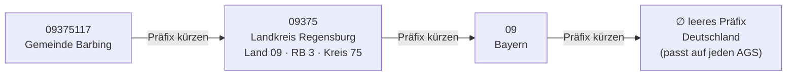

# Daten-Eskalation über Verwaltungsebenen

**Gebaut.** Ein Discovery-Prinzip: Wenn sich Daten für eine kleine Einheit (eine
Gemeinde) nicht finden lassen, schaue auf die nächsthöhere Verwaltungsebene
(Kreis → Land → Bund) — denn der Wert steckt fast immer in einem *umfassenden
Datensatz einer übergeordneten Ebene*, den eine zentralere Stelle vorhält.
Verallgemeinert: **„den Suchraum auf die enthaltende Menge erweitern, dann filtern"**
— und für codierte Regionsschlüssel ist das nahezu kostenlos.

## Warum es funktioniert

Umfassende, standardisierte, offene Datensätze liegen bei den zentralen Stellen
(Landes-Geoportale, das bundesweite **BKG** für Grenzen, **Destatis**/Wikidata für
Statistik, **Eurostat** für die EU). Die maßgeschneiderte Einzel-Veröffentlichung
einer kleinen Einheit ist der *fragile* Weg — sie kann fehlen oder im falschen
Protokoll ausgeliefert werden (realer Fall: ein Landkreis-Geoportal bot seine Grenzen
nur als WMS-Bild an, kein WFS). Die Eskalation auf die höhere Ebene ist daher oft
kein letzter Ausweg, sondern der **bessere Default**.

## Der Mechanismus: Regionsschlüssel kodieren die Hierarchie als Präfix

Der **AGS** (Amtlicher Gemeindeschlüssel) legt die Enthaltung Ziffer für Ziffer offen —
`Land(2) · Regierungsbezirk(1) · Kreis(2) · Gemeinde(3)`:



**Eskalation = Präfix kürzen**, und die Zugehörigkeit ist gratis: `Präfix "09"`
wählt jede bayerische Gemeinde. **NUTS** funktioniert genauso (`DE232 → DE23 → DE2 →
DE`), reicht aber nur bis zur Kreisebene (NUTS-3) — für Gemeinden ist der Schlüssel
der AGS (bei Wikidata über `P439`).

`chester/adminlevels.py` (`region_hierarchy(code)`, ohne Abhängigkeiten) macht aus
einem Code diese Kette, exponiert als das **`region_hierarchy`**-Tool der
Statistik-Capability.

```
region_hierarchy("09375117") →
  Gemeinde → [Kreis 09375, Regierungsbezirk 093, Land 09, Bund ""]
```

## Die eine Regel: den *Suchraum* eskalieren, die *Granularität* behalten

Die Eskalation findet einen Datensatz, der **weiterhin die Werte je Einheit enthält**,
und filtert ihn auf die gewünschte(n) Einheit(en). Es ist **keine** Aggregation:
einen Kreis-*Gesamtwert* für einen fehlenden Gemeindewert einzusetzen ist Fälschung
(siehe „Never fabricate data" in [`SOUL.md`](../setup.py)). Trägt keine Ebene die
nötige Granularität, melde den Blocker.

## Wie Chester es nutzt

- **Statistik:** `stats_table("wikidata", "<prefix>")` — der Connector holt bereits
  Bevölkerung/Fläche je Gemeinde über den AGS-Präfix; ein breiterer Präfix = ein
  breiterer Suchraum. `region_hierarchy` liefert die Präfixe.
- **Grenzen / Geometrie:** die umfassende höhere Ebene holen (ein landesweiter WFS
  oder BKG VG250 für ganz Deutschland) und mit `qgis_clip` /
  `qgis_extract_by_attribute` auf das Gebiet zuschneiden — statt die Datei einer
  einzelnen Gemeinde zu jagen.
- **Policy:** der `find-official-data`-Skill trägt den Eskalationsschritt
  (Katalog → **Ebene eskalieren** → Web-Suche als Fallback) und die Regel „Suchraum,
  nicht Granularität"; die Instructions der Statistik-Capability ebenso.

## Verallgemeinerung über Geografie hinaus

Dieselbe Form — *auf die enthaltende Menge erweitern, dann filtern* — gilt für andere
Enthaltungs-Dimensionen (z. B. Zeit: dieses Jahr → die letzten N Jahre → die volle
Reihe) und für die Autoritäts-Eskalation (lokales Portal → Land → Bund → EU, die meist
mit der Verwaltungsebene zusammen wandert). Die Variante Verwaltungsebene /
Regionsschlüssel ist die häufigste und billigste, weil der Schlüssel die
Enthaltungs-Arithmetik für dich erledigt.
