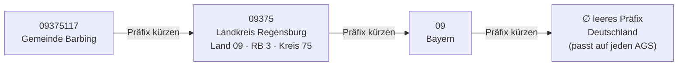

# Geodaten-Suche — amtliche Daten finden, wenn OSM nicht ausreicht

> Begleitdokument zu [`geodata-concept.md`](./geodata-concept.md): jenes beschreibt die
> zwei Bestände (GeoConnectors + GeoCache) und wie Daten leben und altern. Dieses
> behandelt eine konkrete **Akquise-Lücke** — wie Chester *autoritative offene Daten*
> (Verwaltungsgrenzen, thematische Ebenen) findet und holt, für die vielen Fälle, in
> denen OpenStreetMap sie schlicht nicht hat.
>
> **Status: Phasen A–C gebaut und verifiziert** (`geodata_search`, `wfs_capabilities`,
> `fetch_vector` in `DataDiscoveryCapability`; der `find-official-data`-Skill; der
> Abnahmetest in `agent-test-prompts.jsonl`). Phase D (Docs) erledigt. Nur spätere
> Breiten-Optionen (data.gov / Socrata / CSW) bleiben offen.

## 0. These

OpenStreetMap ist Chesters Standard-Vektorquelle, aber es sind **freiwillig** beigetragene
Daten mit ungleichmäßiger Abdeckung. Für eine große Klasse alltäglicher Fragen ist die
gesuchte Ebene gar nicht in OSM — am schärfsten die **sub-kommunalen
Verwaltungsgrenzen** (Stadtbezirke).

Der auslösende Fehlschlag: *„Wie viele Bushaltestellen liegen im Bezirk Innenstadt von
Regensburg?"* Chester holte die 888 Bushaltestellen (die hat OSM), konnte aber die
**Innenstadt-Grenze** nie beschaffen, weil dieses Polygon **nicht in OSM** ist — dreifach
über Overpass verifiziert:

- Nominatim geocodiert „Innenstadt, Regensburg" nicht zu einem Polygon (nur ein falscher
  Punkt-Treffer in einem anderen Ort).
- Innerhalb des Regensburger Stadtgebiets (admin_level 6) hält OSM nur admin_level-5- und
  -6-Grenzen — **keine Stadtteile**.
- Keine Relation / kein Way / kein Node namens „Innenstadt" existiert irgendwo im
  Stadt-bbox.

Der Bezirk *existiert* als **amtliche offene Daten**: die Stadt Regensburg
veröffentlicht ihre Stadtbezirke über einen WFS
(`mapservice.regensburg.de/.../kleingliederung_wfs.map`, `TYPENAME=kleingliederung`),
katalogisiert auf govdata.de. Die Aufgabe ist also lösbar — über eine Quelle, die Chester
bislang nicht entdecken kann.

**Die Regel, die dieses Feature kodiert: fehlt OSM eine Ebene, durchsuche offene Daten.**

## 1. Design-Spannung — Web-Suche vs. Katalog-APIs

Der naheliegende Instinkt ist „einfach googeln". Das ist die richtige **Breiten**-Schicht,
aber der falsche **Primärweg** — wegen einer Unterscheidung:

> **Web-Suche liefert *Seiten*. Katalog-APIs liefern *Datensätze*.**

Ein Web-Treffer landet auf einer Portal-Landingpage; die eigentliche WFS-/GeoJSON-URL muss
dann aus beliebigem HTML herausgekratzt werden — brüchig, nicht reproduzierbar,
token-teuer, SEO-sortiert. Eine Katalog-API gibt eine Ressourcen-**URL + Format + Lizenz**
zurück, direkt handhabbar.

Der Gegen-Instinkt — „die Kataloge hardcoden" — skaliert global ebenfalls nicht. Muss er
auch nicht:

- **CKAN / Socrata / ArcGIS Hub / GeoNode** sind De-facto-Standards. Ein *generischer*
  CKAN-Adapter funktioniert gegen **jedes** CKAN-Portal per Basis-URL (parametrisiert, so
  wie `stac_search(catalog=…)` bereits beliebige STAC-Kataloge akzeptiert).
- **Aggregatoren** decken ganze Kontinente aus einem einzigen Endpunkt ab:
  **data.europa.eu** föderiert >1 Mio EU-Datensätze über eine CKAN-API; govdata.de (DE),
  data.gov (US), data.gov.uk ebenso.
- **OGC CSW** ist der geodaten-spezifische Katalog-Standard hinter nationalen GDIs
  (GDI-DE, INSPIRE) — eine spätere Breiten-Option für reine Geodienst-Discovery.

**Auflösung: gestufte Discovery.** Strukturierte Aggregatoren zuerst (verlässlich, billig,
lizenz-bewusst); **Web-Suche als universeller Fallback** für den Long Tail, den kein Katalog
föderiert (Stadt-Portale, exotische Regionen, PDF-verlinkte Dienste). Keines ersetzt das
andere.

## 2. Architektur — deterministische Tools + ein orchestrierender Skill

Die Aufteilung folgt Chesters bestehender Maserung:
**der Mechanismus ist Code (Tools), die Policy ist ein Skill.**

- Die deterministischen Teile — eine Katalog-API abfragen, Ressourcen-URLs nach Diensttyp
  klassifizieren, WFS-Capabilities parsen, einen Vektor herunterladen — sind **Tools**. Sie
  sind reproduzierbar, testbar, cachebar und tragen Provenienz. Das spiegelt `stac_catalogs`
  (ein Keyword-Discovery-**Tool**, kein Skill) — der Präzedenzfall.
- Die Urteilsteile — einen OSM-Fehltreffer erkennen, einen Kandidaten wählen, strukturiert →
  Web stufen, fetch → reprojizieren → clippen → zählen verketten — sind ein **Skill**.

Alles erweitert die bestehende **`DataDiscoveryCapability`** (die bereits `geocode` /
`osm_features` / `stac_*` / `wfs_features` beherbergt); keine neue
Capability-Klasse, keine Framework-Änderung.

### 2.1 Tools

**`geodata_search(query, catalog_url=None, bbox=None, limit=10)`** — Discovery
- Fragt einen CKAN-artigen Katalog ab. Default: **data.europa.eu** (EU-Aggregator);
  `catalog_url` richtet es auf jedes CKAN-Portal (govdata.de, data.gov, …).
- Gibt sortierte Kandidaten zurück: Titel, Herausgeber, **Lizenz** und jede Ressource
  **nach echtem Diensttyp klassifiziert** (WFS / WMS / GeoJSON / Shapefile / CSV) durch
  **URL-Inspektion** — CKANs Fehlbezeichnungen korrigierend (die Regensburg-Ressource ist
  als „CSV" getaggt, ist aber in Wahrheit `SERVICE=WFS&TYPENAME=kleingliederung`).
- Nur Discovery: kein Scraping, kein Fetch. Spiegelt `stac_catalogs`.

**`wfs_capabilities(url)`** — Typename-Discovery
- Parst `GetCapabilities` → verfügbare `typename`s + Titel + CRS + bbox. Macht
  `wfs_features` nutzbar, ohne den Typename zu raten (dessen aktuelle Kante). Rein
  deterministisch.

**`fetch_vector(url, output_path, bbox=None)`** — generischer Download
- Lädt eine *direkte* Vektor-Ressource (GeoJSON / GML / gezipptes Shapefile / GeoPackage)
  in den GeoCache, für Katalog-Ressourcen, die Datei-Links statt eines Live-Diensts sind.
  Der WFS-*Dienst*-Fall bleibt bei `wfs_features`.

**Wiederverwendet, kein neuer Code:** `wfs_features`, `web_search` / `web_fetch`
(SelmaKit-Defaults), `geocode`, `resolve_path`, `provenance`.

### 2.2 Skill — `find-official-data`

Trägt die Regel *„nicht in OSM → offene Daten"* als `SKILL.md`-Rezept:

- **Auslöser:** eine gebrauchte Ebene fehlt/ist irrelevant in OSM, oder die Aufgabe braucht
  ausdrücklich autoritative Verwaltungs-/Themendaten.
- **Gestuftes Rezept:**
  1. Das Interessengebiet geocodieren.
  2. **Strukturiert zuerst:** `geodata_search` (EU-Aggregator, dann bei Bedarf ein
     nationales Portal).
  3. Treffer → einen Kandidaten wählen → WFS-Weg (`wfs_capabilities` → `wfs_features`) oder
     Direkt-Weg (`fetch_vector`).
  4. **Kein struktureller Treffer → Web-Fallback:** `web_search` / `web_fetch`, um ein
     Portal/einen Dienst zu finden → dieselben Fetch-Tools.
  5. Auf ein metrisches CRS reprojizieren → clippen / räumlich selektieren → validieren →
     Karte / Zählung.
- Erfasst Provenienz + Lizenz; **markiert eine fehlende Lizenz**.

## 3. Querschnittsthemen

- **Provenienz & Confinement:** jeder geholte Datensatz bekommt einen
  `<file>.meta.json`-Sidecar (`source=connector/ckan|wfs|web`, die Query, CRS, Lizenz) und
  landet über `resolve_path` in `<workspace>/geocache/`, wie alle Chester-Ausgaben.
- **Lizenz:** CKAN liefert sie meist explizit — aber für den Regensburg-Record war sie
  **leer**, das Erfassen allein reicht also nicht: eine *fehlende* Lizenz muss markiert
  werden (Attribution/Nachnutzung ist eine Rechtsfrage, und die Karten-Beschriftung hängt
  davon ab).
- **CRS:** deutsche WFS liefern häufig EPSG:25832 (UTM32); normalisieren und erfassen. Die
  bestehende Pipeline reprojiziert vor jeder Messung.
- **Caching / Reproduzierbarkeit:** Katalog-Antworten cachen; Query + Quelle erfassen, damit
  ein Lauf wiederholbar ist und Rate-Limits respektiert werden.
- **Format-Fehlbezeichnung:** CKANs `format`-Feld nie trauen — durch URL-Inspektion
  klassifizieren (`SERVICE=WFS/WMS`, Dateiendung). Das ist die wichtigste Robustheitsregel
  und der Grund, warum der Klassifikator in den Code gehört.

## 4. Phasen

| Phase | Ergebnis | Status | Begründung |
|---|---|---|---|
| **A** | `wfs_capabilities` + `fetch_vector` | **gebaut** | klein, deterministisch, sofort nützlich (auch von Hand); entsperrt alles |
| **B** | `geodata_search` (generisches CKAN; Default data.europa.eu, govdata.de-Fallback) | **gebaut** | strukturierte Breite; data.europa.eu-Abdeckung des Regensburg-Falls bestätigt |
| **C** | `find-official-data`-Skill inkl. Web-Fallback | **gebaut** | verknüpft alles; trägt die OSM-Fehltreffer-Policy |
| **D** | Abnahmetest + Docs | **gebaut** | End-to-End-Beleg; `doc/`-Update |

End-to-end verifiziert: `geodata_search("Stadtbezirke Regensburg")` →
`wfs_features(wfs_url, "kleingliederung")` → 18 Bezirks-Polygone (EPSG:25832), „Innenstadt"
darunter — die Grenze, die in OSM fehlt.

## 5. Abnahmetest

Die ursprünglich gescheiterte Aufgabe, end-to-end, ergänzt in `agent-test-prompts.jsonl`:

`geodata_search("Stadtbezirke Regensburg")` → WFS `kleingliederung` → `wfs_features` →
Filter `name=Innenstadt` → die Bushaltestellen clippen → zählen.

Erfolgskriterien: das Bezirks-Polygon wird aus einer amtlichen Quelle geholt (nicht OSM),
beide Ebenen teilen vor dem räumlichen Test ein metrisches CRS, ein `within`-Prädikat wird
genutzt, und eine plausible Zahl enthaltener Haltestellen wird mit Quelle und Lizenz gemeldet.

## 6. Offene Fragen / Risiken

- **Aggregator-Abdeckung:** govdata.de lieferte den Regensburg-Record sauber; ob
  data.europa.eu denselben kommunalen Datensatz föderiert, ist eine Phase-B-Prüfung. Wenn
  nicht, govdata.de als DE-Default behalten und data.europa.eu für die EU-Breite.
- **Web-Fallback bleibt brüchig** — bewusst ein Fallback, nie der Primärweg.
- **WFS-Dialekt-Eigenheiten:** der Regensburg-Dienst ist WFS 1.0.0 (MapServer,
  Achsreihenfolge-Fallen); `wfs_features` muss Version und Ausgabeformat aushandeln (GeoJSON
  wenn angeboten, sonst GML — es hat bereits einen GML-Fallback).
- **Nicht-CKAN-Kataloge** (Socrata, ArcGIS Hub, CSW) sind für den ersten Wurf out of scope;
  die generische Adapter-Form lässt Raum, später Dialekte zu ergänzen.

## 7. Eskalation über Verwaltungsebenen

> Bis 2026-08-29 ein eigenes Dokument (`data-escalation.md`). Zusammengelegt, weil es
> dieselbe Frage beantwortet wie der Rest dieser Seite — *was tun, wenn die
> naheliegende Quelle den Datensatz nicht hat* — und nie einzeln gelesen wurde.

**Gebaut.** Ein Discovery-Prinzip: Wenn sich Daten für eine kleine Einheit (eine
Gemeinde) nicht finden lassen, schaue auf die nächsthöhere Verwaltungsebene
(Kreis → Land → Bund) — denn der Wert steckt fast immer in einem *umfassenden
Datensatz einer übergeordneten Ebene*, den eine zentralere Stelle vorhält.
Verallgemeinert: **„den Suchraum auf die enthaltende Menge erweitern, dann filtern"**
— und für codierte Regionsschlüssel ist das nahezu kostenlos.

### Warum es funktioniert

Umfassende, standardisierte, offene Datensätze liegen bei den zentralen Stellen
(Landes-Geoportale, das bundesweite **BKG** für Grenzen, **Destatis**/Wikidata für
Statistik, **Eurostat** für die EU). Die maßgeschneiderte Einzel-Veröffentlichung
einer kleinen Einheit ist der *fragile* Weg — sie kann fehlen oder im falschen
Protokoll ausgeliefert werden (realer Fall: ein Landkreis-Geoportal bot seine Grenzen
nur als WMS-Bild an, kein WFS). Die Eskalation auf die höhere Ebene ist daher oft
kein letzter Ausweg, sondern der **bessere Default**.

### Der Mechanismus: Regionsschlüssel kodieren die Hierarchie als Präfix

Der **AGS** (Amtlicher Gemeindeschlüssel) legt die Enthaltung Ziffer für Ziffer offen —
`Land(2) · Regierungsbezirk(1) · Kreis(2) · Gemeinde(3)`:



**Eskalation = Präfix kürzen**, und die Zugehörigkeit ist gratis: `Präfix "09"`
wählt jede bayerische Gemeinde. **NUTS** funktioniert genauso (`DE232 → DE23 → DE2 →
DE`), reicht aber nur bis zur Kreisebene (NUTS-3) — für Gemeinden ist der Schlüssel
der AGS (bei Wikidata über `P439`).

`chester/adminlevels.py` (`region_hierarchy(code)`, ohne Abhängigkeiten) macht aus
einem Code diese Kette, exponiert als das **`region_hierarchy`**-Tool der
Statistik-Capability.

```
region_hierarchy("09375117") →
  Gemeinde → [Kreis 09375, Regierungsbezirk 093, Land 09, Bund ""]
```

### Die eine Regel: den *Suchraum* eskalieren, die *Granularität* behalten

Die Eskalation findet einen Datensatz, der **weiterhin die Werte je Einheit enthält**,
und filtert ihn auf die gewünschte(n) Einheit(en). Es ist **keine** Aggregation:
einen Kreis-*Gesamtwert* für einen fehlenden Gemeindewert einzusetzen ist Fälschung
(siehe „Never fabricate data" in [`SOUL.md`](../setup.py)). Trägt keine Ebene die
nötige Granularität, melde den Blocker.

### Wie Chester es nutzt

- **Statistik:** `stats_table("wikidata", "<prefix>")` — der Connector holt bereits
  Bevölkerung/Fläche je Gemeinde über den AGS-Präfix; ein breiterer Präfix = ein
  breiterer Suchraum. `region_hierarchy` liefert die Präfixe.
- **Grenzen / Geometrie:** die umfassende höhere Ebene holen (ein landesweiter WFS
  oder BKG VG250 für ganz Deutschland) und mit `qgis_clip` /
  `qgis_extract_by_attribute` auf das Gebiet zuschneiden — statt die Datei einer
  einzelnen Gemeinde zu jagen.
- **Policy:** der `find-official-data`-Skill trägt den Eskalationsschritt
  (Katalog → **Ebene eskalieren** → Web-Suche als Fallback) und die Regel „Suchraum,
  nicht Granularität"; die Instructions der Statistik-Capability ebenso.

### Verallgemeinerung über Geografie hinaus

Dieselbe Form — *auf die enthaltende Menge erweitern, dann filtern* — gilt für andere
Enthaltungs-Dimensionen (z. B. Zeit: dieses Jahr → die letzten N Jahre → die volle
Reihe) und für die Autoritäts-Eskalation (lokales Portal → Land → Bund → EU, die meist
mit der Verwaltungsebene zusammen wandert). Die Variante Verwaltungsebene /
Regionsschlüssel ist die häufigste und billigste, weil der Schlüssel die
Enthaltungs-Arithmetik für dich erledigt.
